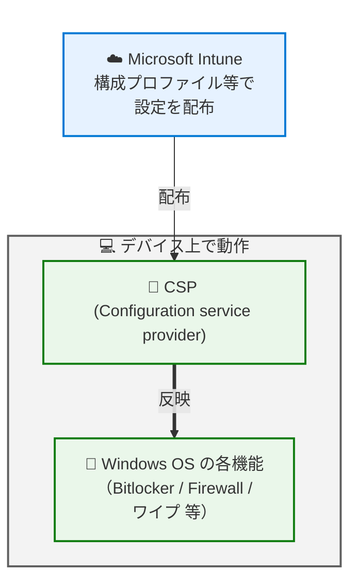
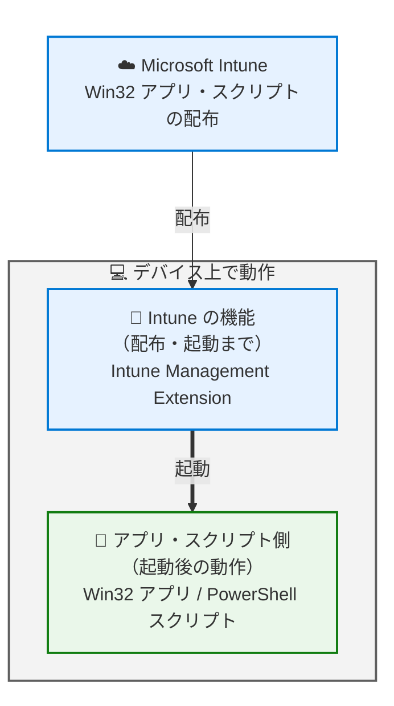
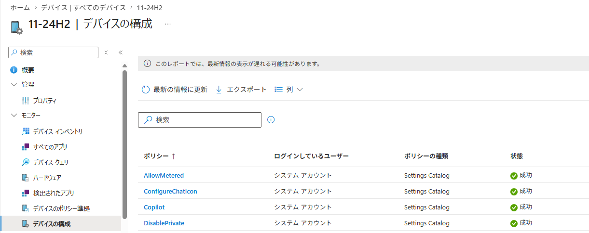
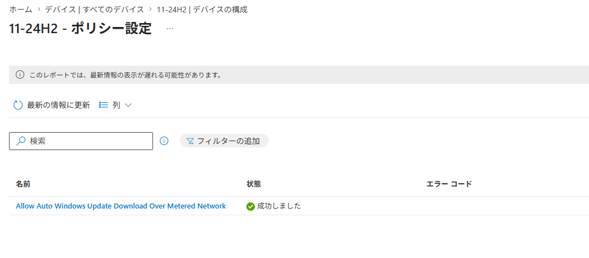
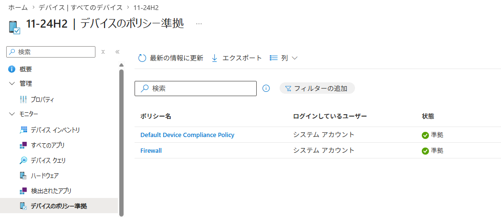
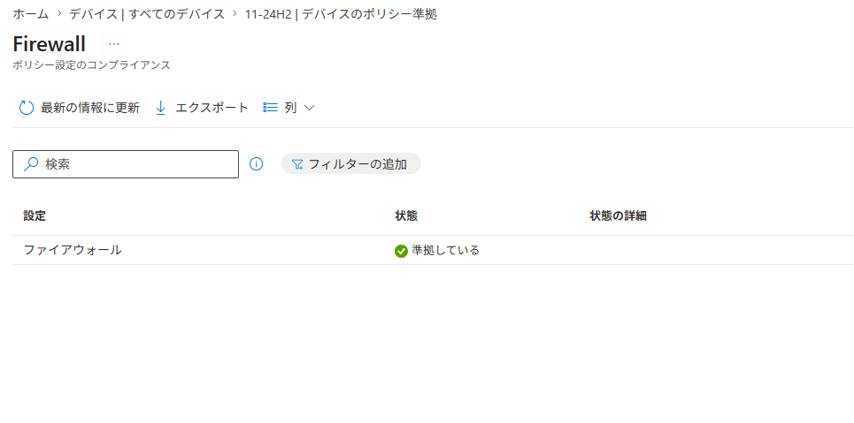

# Intune のトラブル解決が早くなる。知っておきたい Windows との "役割分担" - 基本編

みなさま、こんにちは。Intune サポート チームです。

日々 Intune を活用してデバイス管理を進めていただき、ありがとうございます。今回は、Intune を運用されている皆さまにぜひ知っておいていただきたい「Intune と Windows の役割分担」についてご紹介します。

一見すると地味なテーマに思えるかもしれませんが、この "境界" を理解しておくと、いざ問題が起きたときに「どこを確認すればよいか」がすぐに分かるようになり、原因の特定や解決までの時間を大きく短縮できます。運用のストレスを減らし、より快適に Intune をお使いいただくための第一歩として、ぜひ最後までお読みください。

## はじめに ― なぜ「切り分け」が大切なのか

Intune の様々な機能は、その裏側で Windows OS が持つ多彩な機能を利用して動作しています。そのため、何か想定通りに動かない事象が起きたとき、その原因が **Intune 側にあるのか、それとも Windows 側にあるのか** をあらかじめ切り分けておくことがとても重要です。

事前に切り分けができていると、次のようなメリットがあります。

- 確認すべきログや設定のポイントを最初から絞り込めるため、調査がスムーズに進む
- ご自身での解決につながるケースも多く、待ち時間なく対処できる
- 万一サポートへお問い合わせいただく場合でも、最初から的確な情報をもとに調査を開始できる

切り分けを進めるにあたって、あわせて確認しておくとよい点が 2 つあります。

1 つは、サポート契約の範囲です。お持ちの契約内容によっては、Windows OS に関するサポートが Intune とは別の扱いになる場合があります。問題が Windows 側にあると分かった際にスムーズに動けるよう、ご自身の契約でどこまでカバーされるかをあらかじめ把握しておくと安心です。

もう 1 つは、ライセンスに関するお問い合わせの窓口です。ライセンスに関するご相談は技術サポートではお受けできませんので、担当の営業担当者やライセンスの購入元へお問い合わせください。

## Windows OS における MDM 管理の仕組み

まずは、Intune がどのように Windows デバイスを管理しているのか、その全体像を押さえておきましょう。Intune には大きく分けて「**設定 (CSP) の配布**」と「**Win32 アプリ・スクリプトの配布**」という 2 つの経路があります。それぞれカバーする範囲が少し異なるため、順番に図で見ていきましょう。

### パターン 1：設定 (CSP) の配布

1 つ目は、構成プロファイルなどで設定を配布するパターンです。Intune は MDM チャネルを通じて設定を届け、その設定を受け取って実際に反映・動作させるのは Windows OS 側（CSP/Configuration service provider と各 OS 機能）です。


つまり、Intune はあくまで設定を届ける役割であり、その設定が適用された後にどう振る舞うかは Windows OS 側が担当している、というのが基本的な考え方です。**「設定が届くまで」が Intune、「届いた設定の動作」が Windows** という線引きになります。

### パターン 2：Win32 アプリ・スクリプトの配布

2 つ目は、Win32 アプリや PowerShell スクリプトを配布するパターンです。この場合は、Intune Management Extension と呼ばれる Intune 専用のエージェントが配布・起動を担当します。**この Intune Management Extension までが Intune の機能が提供する範囲** です。



Intune Management Extension がアプリのインストーラーやスクリプトを起動した後の処理は、それぞれのインストーラーやスクリプト自身が担います。そのため、アプリやスクリプトの動作で問題が起きた場合は、それらが出力するログの確認が必要になります。特にサードパーティー製のアプリをご利用の場合は、問題発生時に備えて **提供元のサポート窓口** をあらかじめ確認しておくことをおすすめします。

なお、本記事では主に設定 (CSP) の配布に焦点を当てて解説します。アプリやスクリプトの配布については、今後のブログであらためて詳しくご紹介する予定です。

## 設定 (CSP) が Intune から配布されているかを確認する方法

「設定が思ったように反映されない」というとき、まず確認したいのが **Intune からの設定配布自体が完了しているかどうか** です。ここが確認できると、問題が「配布まで」なのか「配布後の動作」なのかを切り分けられます。確認方法は大きく 3 つあります。

### 1. Intune 管理センターからの確認方法

設定 (CSP) が Intune から配布されているかは、基本的に Intune 管理センターの下記の画面から確認できます。「成功」と表示されている構成プロファイルについては、Intune からの設定 (CSP) の配信自体は完了していると判断できます。

`[デバイス] - [すべてのデバイス] - [<確認対象のデバイス>] - [デバイスの構成]`



対象のプロファイルを選択すると、各設定の配信状況をより細かく確認できます。

`[デバイス] - [すべてのデバイス] - [<確認対象のデバイス>] - [デバイスの構成] - [<確認対象の構成プロファイル>]`



同様に、コンプライアンス ポリシーについても下記の画面から確認できます。

`[デバイス] - [すべてのデバイス] - [<確認対象のデバイス>] - [デバイスのポリシー準拠]`



`[デバイス] - [すべてのデバイス] - [<確認対象のデバイス>] - [デバイスのポリシー準拠] - [<確認対象のコンプライアンス ポリシー>]`



また、構成プロファイルの配信が想定通りに進まない場合には、`[デバイス] - [すべてのデバイス]` から「最後のチェックイン」の時刻を確認し、Intune とデバイスの同期が実際に行われているかを確認することも大切です。同期が行われていなければ、そもそも設定が届いていない可能性があります。


### 2. Windows 上でのレジストリからの確認方法

Intune 管理センターからだけでなく、Windows のレジストリからも確認できます。Intune で配布されている Policy CSP の設定の多くは、下記の配下のレジストリに反映されます。ここに値が反映されていれば、Intune からの設定配信自体は正常に行われていると判断できます。

```
HKEY_LOCAL_MACHINE\SOFTWARE\Microsoft\PolicyManager\current\device
HKEY_LOCAL_MACHINE\SOFTWARE\Microsoft\PolicyManager\current\<ユーザーの SID>
```

例えば、DeliveryOptimization の DODownloadMode という Policy CSP が配信されている場合には、下記の図のように `HKEY_LOCAL_MACHINE\SOFTWARE\Microsoft\PolicyManager\current\device\DeliveryOptimization` にその値が反映されます。

- ポリシー CSP - DeliveryOptimization / DODownloadMode
  https://learn.microsoft.com/ja-jp/windows/client-management/mdm/policy-csp-deliveryoptimization#dodownloadmode


### 3. Windows 上でのイベント ログからの確認方法

注意点として、エラーで Intune からの Policy CSP の配信が失敗している場合や、Policy CSP 以外の通常の CSP の場合は、上記のレジストリに反映されないものも多くあります。このようなときは、イベント ログで CSP の配信状況やエラーの内容を確認できることがあります。

CSP に関する多くのエラーは、イベント ビューアー内の `[アプリケーションとサービス ログ] - [Microsoft] - [Windows] - [DeviceManagement-Enterprise-Diagnostics-Provider] - [Admin]` から確認できるイベント ログに記録されます。

例えば、ワイプの CSP の実行に失敗した場合には、下記の公開情報に記載されているようなイベントが記録されます。

- RemoteWipe が Windows 10 クライアントで実行できない場合、要求はサポートされません
  https://learn.microsoft.com/ja-jp/troubleshoot/mem/intune/device-management/remotewipe-fails-sending-dowipe-command

```
ログ名: Microsoft-Windows-DeviceManagement-Enterprise-Diagnostics-Provider/Admin
ソース: DeviceManagement-Enterprise-Diagnostics-Provider
イベント ID: 400
コンピューター: デスクトップ PC
ユーザー: システム
詳細: MDM ConfigurationManager: コマンドエラーの状態。 構成ソース ID: (9B5DC01F-D64E-488A-BB24-F0E9DA4FBF47)、登録名: (MDMFull)、プロバイダー名: (RemoteWipe)、コマンドの種類: (CmdType_Execute)、CSP URI: (./Vendor/MSFT/RemoteWipe/doWipe)、結果: (要求はサポートされていません。)。
```

このように、イベント ログにはエラーの原因を示す具体的な情報が記録されるため、切り分けの大きな手がかりになります。

## 「これは Intune？ それとも Windows？」― 事象別の考え方

ここまでの内容を踏まえて、実際にどのような事象がどちら側の調査対象になるのかを整理してみましょう。基本的な考え方はシンプルです。

- **Intune からの設定の "配信" に関すること** → Intune の観点から確認
- **設定自体の "挙動" や、配布後の "動作" に関すること** → Windows の観点から確認

以下に具体的な例を挙げます。ご自身で事象を切り分ける際の参考にしてください。

### Intune 側に焦点を当てて確認するとよい事象

- Intune とデバイスの同期ができておらず、構成プロファイルの配信が行われない
- Windows のレジストリ上では設定の反映が確認できるものの、Intune 管理センター上では構成プロファイルの配信状況が確認できない
- 構成プロファイルの割り当てをフィルターで行っているが、意図したデバイスが配信対象とならず適用外になってしまう

### Windows 側に焦点を当てて確認するとよい事象

- Windows 上で特定の設定変更などをブロックしたいが、どのような設定を Intune から配信すればよいかを知りたい
- Intune 管理センター上ではプロファイルの配信が「成功」と表示され、Windows のレジストリ上も設定の反映が確認できているのに、期待した動作が Windows 側で得られない
- Intune 管理センター上ではプロファイルの配信が「エラー」と表示され、イベント ログを確認すると Windows 側からエラーが返されている
- Intune からワイプを実行したところ、Windows 上でワイプは開始されるものの、途中で処理が失敗してしまう

ポイントは、**「設定がデバイスに届いているか」までが Intune の領域、「届いた設定がどう動くか」からが Windows の領域** ということです。この線引きを意識するだけで、確認すべき方向がぐっと明確になります。

## ログの採取 ― いざというときのために

上述したレジストリやイベント ログは、下記の手順で Intune 管理センターから取得できる診断情報の中にも含まれています。事象を切り分ける際はもちろん、サポートへお問い合わせいただく際にも、これらのデータをあわせてご提供いただけると調査をスムーズに進められます。

- デバイス アクション: 診断を収集する
  https://learn.microsoft.com/ja-jp/intune/device-management/actions/collect-diagnostics?tabs=reg&pivots=windows

日頃から取得方法を把握しておくと、いざというときに慌てずに対応できます。

## おわりに

今回は、Intune と Windows の "境界" という視点から、デバイス管理のトラブルシューティングを進めるうえでの基本的な考え方をご紹介しました。

- Intune は「設定を配布する」役割、Windows は「配布された設定を動作させる」役割
- 「設定が届いているか」は Intune 管理センター・レジストリ・イベント ログで確認できる
- 事象が「配信まで」なのか「配信後の動作」なのかで、確認すべき方向が変わる

この考え方を身につけていただくと、問題が起きたときに落ち着いて原因を切り分けられるようになり、より快適に Intune をご活用いただけるはずです。ぜひ日々の運用に取り入れてみてください。

次回以降も、皆さまの運用に役立つ情報をお届けしていきます。最後までお読みいただき、ありがとうございました。
