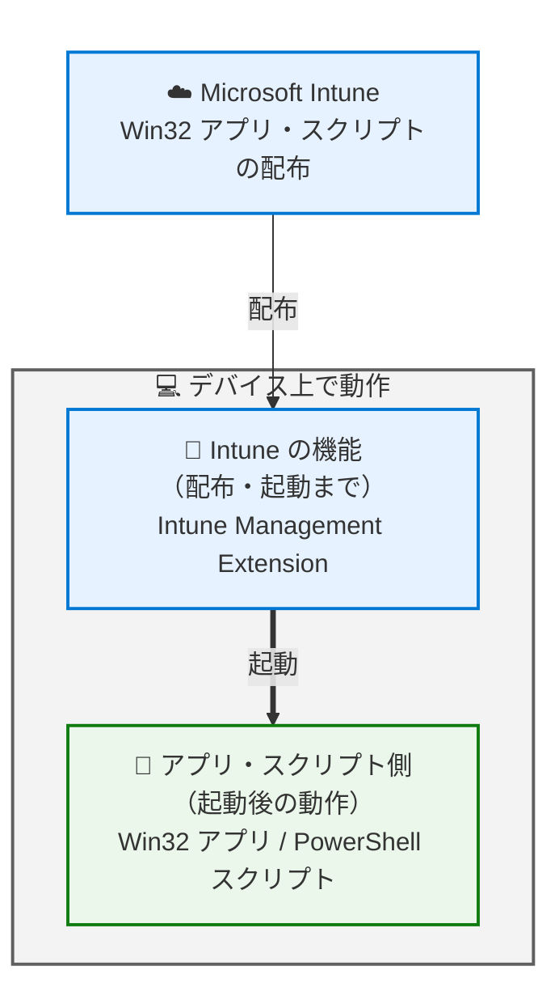

# 意外と見落としがち？Intune で Win32 アプリを配布する前に確認しておきたいポイント

みなさま、こんにちは。Intune サポート チームです。

Intune を使うことで、社内の業務アプリや作成したスクリプト等を Win32 アプリとして、各デバイスへ配信することが出来ます。一方で、いざ配布を始めてみると「手元では問題なくインストールできたのに、Intune から配布するとなぜかうまくいかない…」なんてこともありますよね。実はちょっとしたコツを知っているだけで、このような問題をすんなり解決できてしまうケースが多いのです。

そこで今回は、Win32 アプリを本格的に展開する前に「これだけ押さえておけば安心！」という 3 つのポイントを、ご紹介していきます。事前にサクッと確認しておくことで、配布後の問題を減らし、気持ちよくアプリ展開を進めていきましょう。

そのカギとなるのが、Intune からの Win32 アプリの配信の流れを知っておくことです。Intune はアプリを「配布して起動する」ところまでを担当し、起動された後のインストール処理そのものはアプリのインストーラーにバトンタッチされます。このバトンの受け渡しをイメージしておくと、後の内容もスッと入ってきますので、ぜひ頭の片隅に置いておいてください。

## ① インストール コマンドの動作を事前に確認しておく

「そんなの当たり前でしょ？」と思われるかもしれませんが、Intune ならではの動作の特性を知らずに進めると、意外なところでつまずくことがあります。逆に言えば、ここさえ押さえておけば安心。特に見落とされやすい 3 つの観点を見ていきましょう。

### 32 ビット / 64 ビットのどちらで実行されるか意識しておく

まず知っておきたいのが、Intune は既定では 32 ビット プロセスとしてインストール コマンドを実行するという点です。ですので、事前に動作を確認するときは、32 ビット版のコマンド プロンプト (`C:\Windows\SysWOW64\cmd.exe`) から実行して、無事に完了するか見ておくのが良いです。

ここでちょっとした落とし穴が一つあります。スタート メニューから起動するコマンド プロンプトは、実は 64 ビット版 (`C:\Windows\System32\cmd.exe`) なんです。何気なく開いたコマンド プロンプトで確認すると、Intune が実際に動く環境とは違う条件でテストしてしまうことになります。ここを合わせておくだけで、確認の精度が上がります。

一方で、Intune から 64 ビット プロセスとしてインストール コマンドを実行させたい場合には、インストール コマンドを記載したバッチ ファイル等を用意しておき、Win32 アプリのインストール コマンドを設定する際に、次のように `Sysnative` 配下のコマンド プロンプトからバッチ ファイルを起動するようにすると、64 ビット プロセスとしてインストール コマンドを実行させることが可能です。

インストール コマンドの例
```
%systemroot%\Sysnative\cmd.exe /c <インストールに利用するバッチ ファイル>
```

`Sysnative` は、32 ビット プロセスから 64 ビット プロセスを呼び出すための特別なエイリアスです。エクスプローラー等で `%systemroot%\Sysnative\` を参照しても見つかりませんが、これは問題ありませんのでご安心ください。`Sysnative` 配下のコマンド プロンプトから起動したバッチ ファイルの動作を確認したい場合は、64 ビット版のコマンド プロンプトを利用して確認していただければ問題ありません。

#### 補足: なぜ `System32` ではなく `Sysnative` を使う必要があるの？

32 ビット プロセスが `C:\Windows\System32` を参照しようとしても、WOW64 のファイル システム リダイレクトによって `C:\Windows\SysWOW64` (32 ビット側) に自動的に飛ばされてしまいます。そのため、インストール コマンドで  `C:\Windows\System32` 配下の `cmd.exe` を指定しても、実際には `C:\Windows\SysWOW64` 配下の cmd.exe が起動されてしまいます。32 ビット プロセスから本来の 64 ビット側の System32 を指し示すには、リダイレクトされない特別なエイリアスである `Sysnative` を利用する必要があります。

さらに、32 ビットと 64 ビットのどちらのプロセスで実行するかによって、コマンド内で参照されるパスやレジストリの解決先も変わる点に注意が必要です。`Sysnative` 経由で 64 ビット プロセスとして実行した場合は、`%ProgramFiles%` は `C:\Program Files` (64 ビット側) を指し、レジストリも `WOW6432Node` を経由しない native 側を参照します。一方、既定の 32 ビット プロセスのまま実行した場合は、`%ProgramFiles%` は `C:\Program Files (x86)` にリダイレクトされ、レジストリも `WOW6432Node` 配下を参照することになります。そのため、レジストリを設定するだけのちょっとしたスクリプトであっても、こういった点は注意しないと、意図した場所にレジストリが設定されなくなってしまいます。

インストール コマンドが特定のパスやレジストリ キーを参照している場合、32 ビット / 64 ビットのどちらで動くかで結果が変わってきます。この違いをちょっと意識しておくと、後で「あれ？」となることをうまく避けられます。

### ユーザー コンテキスト / システム コンテキスト、どちらで実行するか事前に決めておく

次のポイントは、インストール コマンドをユーザー コンテキストとシステム コンテキストのどちらで実行するか、という点です。

ユーザー コンテキストで確認するなら、`cmd.exe` をダブル クリックして立ち上げれば OK です。一方、システム コンテキストで配布する予定なら、確認もシステム コンテキストで行うのがコツです。同じ条件でテストしておくことで、本番でも安心して展開できます。

システム コンテキストでコマンド プロンプトを立ち上げる際は、[PsExec](https://learn.microsoft.com/ja-jp/sysinternals/downloads/psexec) というツールを利用すると便利です。PsExec を利用して次のようなコマンドを実行することで、システム権限でコマンド プロンプトを立ち上げ、システム コンテキストでのインストール コマンドの動作確認を行うことができます。

```
# 32 ビット版のコマンド プロンプトをシステム コンテキストで立ち上げ
psexec -s -i C:\Windows\SysWOW64\cmd.exe

# 64 ビット版のコマンド プロンプトをシステム コンテキストで立ち上げ
psexec -s -i C:\Windows\System32\cmd.exe
```
※ 立ち上げたコマンド プロンプトで `whoami` コマンドを打つと、実際にシステム コンテキストで動作していることを確認できます。
 
というのも、アプリによってはシステム コンテキストでのインストールを想定していないものもあるからです。「ユーザーに管理者権限がないから、とりあえずシステム コンテキストで」と選びたくなる場面もありますが、そんなときこそ事前の一手間が効いてきます。システム コンテキストで配布するなら、同じ条件でひと通り動かしておくと、より確実です。

### サイレント インストールが成功するか事前に確認しておく

3 つめは、ユーザーの操作なしで、サイレントにインストールが完了するかどうかです。

Intune から配布する Win32 アプリは、基本的に「ユーザーは何もしなくてもインストールが進む」ことを前提にしています。もしインストール中にウィザードが立ち上がって入力を求められるようなら、サイレント インストール用のオプションが用意されていることが多いので、アプリの提供元のドキュメントやサポート窓口を利用してみてください。オプションの指定方法はインストーラーごとに個性があるので、ここはアプリの提供元を頼るのが確実です。

## ② Win32 アプリの検出規則を決めておく

動作確認と並んで、確実に押さえておきたいのが「検出規則」です。ここを上手に設定できると、配布がぐっとスムーズになります。

### そもそも検出規則とは？

検出規則とは、Intune が「このアプリ、デバイス上にインストール完了してるかな？」を判定するための目印のようなものです。ファイルやレジストリ、あるいは PowerShell スクリプト等を使って、「この条件を満たしていたらインストール完了」と細かく指定できます。

この目印がうまく合っていないと、インストール自体は成功していても、Intune 側は「まだ完了していない？」と受け取ってしまうことがあります。実際、インストール コマンドが正常に終わっているのに検出規則が満たされていないと、Intune はエラー `0x87D1041C` (`-2016345060`) として扱います。逆に言えば、検出規則さえピタッと合わせておけば、こうしたすれ違いはしっかり防げます。

### 検出規則はいつ評価されるのか？

検出規則は、次のようなタイミングで評価されます。

- Win32 アプリの配信が開始される前
- Win32 アプリのインストール コマンドが実行された直後
- 必須として割り当てている場合は、その後も定期的に

ここでちょっと面白いのが、検出規則は配信の「前」にも評価されるという点。つまり、既に条件を満たしている（＝もうインストール済みの）デバイスには、Intune はわざわざ再配信をしません。

もう一つのポイントは、判定がインストール完了の「直後」に行われること。ですので、「完了してからしばらく経たないと作られないファイル」や「一度アプリを起動しないと現れない値」や「利用中に変更されてしまう可能性がある値」を検出規則に選ぶのは避けるのがおすすめです。すぐに現れる、確実な検出規則を選んでおくと、判定がスムーズに決まります。

また、インストール コマンドとしてバッチ ファイルやスクリプトを指定している場合には、インストール コマンド (バッチ ファイルやスクリプト) が終了したタイミングで検出規則の評価が行われるというのも注意が必要なポイントです。スクリプト内で呼び出した別のプロセスが完了する前に、スクリプト自体が先に終了してしまうと、実際のインストールがまだ途中であっても、その時点で検出規則が評価されてしまいます。すると、まだ目印となるファイルやレジストリ値が作られていないため、Intune は「インストールに失敗した」と判断してしまうことがあるのです。

たとえば、バッチ ファイルの中から別のインストーラーを起動して、そのまますぐにバッチ ファイルが終了するようなケースが該当します。この場合、起動したインストーラーの処理が裏で続いていても、バッチ ファイルはその完了を待たずに終わってしまいます。このようなときは、`start /wait` を使って呼び出したプロセスの終了を待つようにしたり、PowerShell であれば `Start-Process -Wait` を利用したりして、実際のインストール処理が終わるまでスクリプトが終了しないように制御してあげると安心です。「スクリプトが終わる ＝ インストールが本当に終わっている」という状態をきちんと作っておくことが、すれ違いを防ぐコツです。

検出規則として何を設定すべきか迷った場合は、アプリの提供元に、インストール完了時に作成されるファイルやレジストリ値を確認してみるとよいでしょう。提供元はそのアプリの内部の動作を最もよく把握しているため、適切な検出規則を選ぶうえで頼りになります。

## ③ いざというときのために、インストーラーのログの出どころを知っておく

最後は、もしもの時に慌てないための「ログ」のお話です。Intune から Win32 アプリを配布すると、Intune Management Extension がインストール コマンドを起動した後の処理は、次の図のように、インストーラーへ処理がバトンタッチされます。そのため、Intune Management Extension のログからわかるのは、プロセスのリターン コードまで、ということになります。



ちなみに、このリターン コードは Intune が成否を見分ける手がかりにもなっています。既定では `0` と `1707` が成功、`3010`・`1641` は再起動をともなう成功として扱われます。また、リターン コードが成功でも、それだけで「完了」にはなりません。② のとおり最終判定は検出規則の役目なので、「成功コードは返っているのに検出規則が満たされず失敗扱い」というすれ違いも起こります。

運用が始まると、時には想定外のできごとに出会うこともあります。そんなときに頼りになるのがアプリのインストーラーのログです。ログがどこに出力されるのか、またインストーラーのログの解析はどこにすればよいのかを配布前に確認しておくだけで、いざというときの安心感が大きく変わってきます。想定外のリターン コードが発生する場合や、検出規則が満たされない場合は、アプリのインストーラーのログから状況を見る必要があります。特にサードパーティー製のアプリの場合、インストール処理の内部の動作を最もよく把握しているのは提供元ですので、サポート窓口をあらかじめ確認しておくと良いでしょう。

また、PowerShell スクリプト等を使う場合は、スクリプトの中にログ出力を組み込んでおくことをお勧めします。どの処理まで進んで、どこで問題が発生したかを把握しやすくなり、後々の調査に役立ちます。自作のスクリプトを利用する際は、ぜひ取り入れてみてください。

## おわりに

今回は、Win32 アプリを配布する前に押さえておきたい 3 つのポイント――インストール コマンドの動作確認、検出規則の設計、そしてインストーラーのログの出どころ――をご紹介しました。

どれも、配布前のちょっとしたひと手間で、その後の展開がぐっとラクになるものばかりです。なかでも「Intune はアプリを起動するところまで、その先はアプリにバトンタッチ」という流れをイメージしておくと、いざというときも「まずはどこを見ればいいか」がスッとわかるようになります。

この記事が、みなさまの Win32 アプリ展開を後押しできたらうれしいです。それでは、また次回の記事でお会いしましょう！