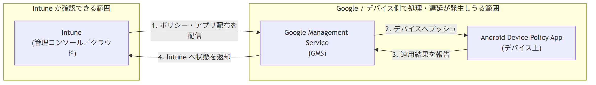

# Android デバイスを Intune で管理する際に押さえておきたいポイント

Microsoft Intune サポート チームです。本記事では、Android デバイスを Intune（MDM）で管理する際に、あらかじめご理解いただきたい Android プラットフォーム固有の仕様についてご案内します。

これらのポイントを事前にご理解いただくことで、**お問い合わせ時の状況共有がスムーズになり、原因の切り分けや問題解決までの時間を短縮できます。**「Intune 側の問題なのか」「Android／ベンダー側の仕様なのか」「GMS（Google Mobile Services）経由の遅延なのか」を切り分ける観点をあらかじめ共有することが、早期解決の鍵となります。

---

## なぜ事前理解が重要なのか（本記事の目的）

Android の MDM 管理は、iOS/iPadOS や Windows と異なり、**Google のサービス（GMS）やデバイス ベンダーの実装に強く依存する**という特徴があります。そのため、同じ操作でも動作結果がデバイスやメーカーによって変わることがあります。

Intune はクラウド サービスとして「構成プロファイル（ポリシー）をデバイスへ配信し、適用状況を受け取る」までを担いますが、**その先の実際の適用処理は Android OS／GMS 側で行われます。** この役割分担を理解しておくと、以下のようなメリットがあります。

- お問い合わせ時に、切り分けに必要な情報（デバイス メーカー、モデル、Android バージョン、登録方式など）を最初から共有いただける
- 「Intune 側で確認できる範囲」と「Android／ベンダー側の要因」を切り分けやすくなる
- 不要な調査ステップを省け、結果として**解決までの時間が短縮**される

---

## 1. Android の MDM 登録は「Android Enterprise」が前提

現在、Android デバイスを Intune で MDM 管理する場合、原則として **Android Enterprise** に対応したデバイスであることが前提となります。従来の Device Administrator（デバイス管理者）方式は Google により非推奨・機能縮小が進んでおり、新規の管理方式としては推奨されません。

Android Enterprise では、主に以下の管理方式があります。

- **個人所有の仕事用プロファイル（Work Profile / BYOD）**
- **完全管理対象デバイス（Fully Managed / COBO）**
- **業務専用デバイス（Dedicated / COSU、キオスク用途など）**
- **企業所有の仕事用プロファイル（COPE）**

そのため、管理対象とする Android デバイスが **Android Enterprise に対応しているか**を、導入前に必ずご確認ください。

### 対応デバイスの公開情報

Android Enterprise の対応デバイスは、Google が公式に公開している以下のリストからご確認いただけます。お問い合わせ前に、対象デバイスがこのリストに含まれているかをご確認いただくと、切り分けがスムーズになります。

- **Android Enterprise Recommended（Google 公式・推奨デバイス一覧）**
  <https://androidenterprisepartners.withgoogle.com/devices/>
- **Android Enterprise 対応の要件・管理方式（Google 公式ドキュメント）**
  <https://developers.google.com/android/work/requirements>
- **Intune における Android 登録方式のサポート情報（Microsoft Learn）**
  <https://learn.microsoft.com/mem/intune/enrollment/android-enroll>

> ※ Android Enterprise Recommended に掲載されているデバイスは、Google が定める品質・アップデート要件を満たしており、企業利用に適したデバイスとして推奨されます。

---

## 2. ベンダー（メーカー）ごとに仕様が異なる点にご注意ください

Android デバイスは Google が提供する OS をベースに、**各デバイス メーカーが独自のカスタマイズを加えて出荷**しています。このため、同じ Android バージョン・同じ Intune ポリシーであっても、**メーカーによって MDM 制御の挙動が異なる**場合があります。
特に、ソフトウェア アップデートに関しては、各メーカーごとに配布ポイントを保持しているため、設定アプリ経由ではなく、独自の管理アプリ経由で、配布される可能性があるため、メーカごとで挙動が変わる可能性が高い設定といえます。

上記のソフトウェア アップデートに関わらず、特定メーカー・特定モデルでのみ発生する事象については、**デバイス メーカー（ベンダー）へのご確認が必要**となる場合があります。
このため、お問い合わせの際は、**メーカー名・モデル名・Android バージョン**をあわせてお知らせいただくと、この切り分けを迅速に行えます。

---

## 3. Intune は「アプリ／設定を直接配布」しているわけではありません（GMS 経由）

Android Enterprise デバイスでは、基本的には、Intune から**直接的に**アプリや設定をデバイスへ配布しているわけではなく、**GMS（Google Mobile Services）を経由して**処理が行われる仕組みになっています。

そのため、Intune 側で確認できるのは、あくまで **「構成プロファイル（ポリシー）の配信・適用が成功したこと」まで**です。その後の実際のアプリ インストールや設定反映は、Google 側のサービスを通じて行われます。

この仕組みを踏まえると、次の点をご理解いただくことが重要です。

- Intune の管理コンソール上で「適用成功」と表示されていても、それは**ポリシーがデバイスへ正しく届き、適用処理が受理された**ことを示します。
- 実際のアプリ配布や設定の最終的な反映は **GMS 側の処理**に委ねられます。

### 図：Intune から Android へアプリ／設定が届くまでの流れ（GMS 経由）

**図のポイント**

- **①：Intune が確認できる範囲** — Intune は「ポリシー／アプリ配布を Google Management Service（GMS）へ引き渡し、受理された」ことまでを管理します。コンソール上の「適用成功」表示は、この段階までを示します。
- **②〜③：GMS／デバイス側で実処理が行われる範囲** — GMS がデバイス上の Android Device Policy App へポリシー・アプリ配布をプッシュし、実際の適用が行われます。ここはネットワーク状況、電源・バッテリー最適化、GMS との同期タイミングなどの影響を受けます。
- **④：結果の連携** — デバイス（Android Device Policy App）での処理結果が GMS を経由して Intune に返され、最終的なステータスが反映されます。

---

## 4. アプリやポリシー適用遅延について

上記の仕組みにより、**構成プロファイルの適用が Intune 上で正常に完了していても、GMS 経由の処理により、実際のデバイスへの反映にタイムラグ（遅延）が生じる**ことがあります。

そのため、適用直後に反映が確認できない場合でも、しばらく時間をおいてから再度ご確認いただくことで解消する可能性がございます。「Intune 上は成功しているのに反映されない」という事象は、この GMS 経由の遅延が原因であるケースが少なくありません。

---

## 5. アプリを Intune から配布するには「Managed Google Play」への登録が必要

Android Enterprise デバイスへ Intune 経由でアプリを配布するには、**Managed Google Play（マネージド Google Play）** の利用が前提となります。テナントを Managed Google Play に接続（バインド）することで、Intune の管理コンソールから承認済みアプリを配布・管理できるようになります。

Android Enterprise では、アプリはすべて Managed Google Play を通じて配布されます。Intune 上で扱えるアプリの種類と、それぞれの配布方法は以下のとおりです。

| アプリの種類 | 概要 | 配布の仕組み |
|---|---|---|
| **ストア アプリ（Managed Google Play アプリ）** | Google Play 上の一般公開アプリを承認して配布 | Managed Google Play で承認 → Intune で割り当て |
| **ライン オブ ビジネス（LOB）／プライベート アプリ** | 自社開発などの独自 APK を、社内限定で配布 | Managed Google Play に非公開アプリとして登録 → Intune で割り当て |
| **Web アプリ（Web リンク）** | Web サイトへのショートカット | Managed Google Play の Web アプリとして配信 |
| **システム アプリ（OEM プリインストール）** | デバイスに組み込み済みのアプリを有効化 | Managed Google Play 経由で有効化 |

> ポイント：**LOB（社内アプリ）であっても、Android Enterprise では Managed Google Play への登録（非公開アプリとしての公開）が必要**です。iOS のように APK を Intune へ直接アップロードして配布する方式ではありません。

### 参考：Intune の公開情報（Microsoft Learn）

- **Intune を Managed Google Play に接続する**
  <https://learn.microsoft.com/mem/intune/enrollment/connect-intune-android-enterprise>
- **Managed Google Play アプリ（ストア アプリ）を Intune に追加する**
  <https://learn.microsoft.com/mem/intune/apps/apps-add-android-for-work>
- **Managed Google Play のプライベート（LOB）アプリを追加する**
  <https://learn.microsoft.com/mem/intune/apps/apps-add-android-for-work#managed-google-play-private-apps>
- **Managed Google Play の Web アプリ（Web リンク）を追加する**
  <https://learn.microsoft.com/mem/intune/apps/web-app>
- **Android Enterprise 向けのアプリの管理（配布方法の全体像）**
  <https://learn.microsoft.com/mem/intune/apps/apps-supported-intune-apps>
- **アプリの割り当てと配布の概要**
  <https://learn.microsoft.com/mem/intune/apps/apps-deploy>

> ※ URL は掲載時点での代表的な参照先です。公開前に各ページが最新の掲載先を指しているか最終確認をおすすめします。

Managed Google Play への接続が完了していない場合、上記いずれのアプリ配布機能もご利用いただけません。アプリ配布に関するお問い合わせの際は、**Managed Google Play への接続が完了しているか**を事前にご確認ください。

---

## まとめ：スムーズなサポートのために

Android の MDM 管理は、**Intune・Android OS・GMS・デバイス ベンダー**という複数の要素が関わる仕組みです。以下の点をあらかじめご理解・ご確認いただくことで、切り分けが迅速になり、問題解決までの時間を短縮できます。

| ポイント | 事前にご確認いただきたいこと |
|---|---|
| 登録方式 | 対象デバイスが Android Enterprise 対応か |
| ベンダー依存 | メーカー名・モデル名・Android バージョン |
| 配布の仕組み | 事象が Intune 側か、GMS／ベンダー側か |
| 反映遅延 | 適用成功後、時間をおいて再確認したか |
| アプリ配布 | Managed Google Play に接続済みか |

お問い合わせの際は、上記の情報をあわせてお知らせいただけますと、**より迅速で的確なサポート**を提供可能となるため、ご協力のほど、よろしくお願いいたします。

この度は、最後までお読みくださりまして、誠にありがとうございました。次回の記事でもお会いできれば嬉しいです。
