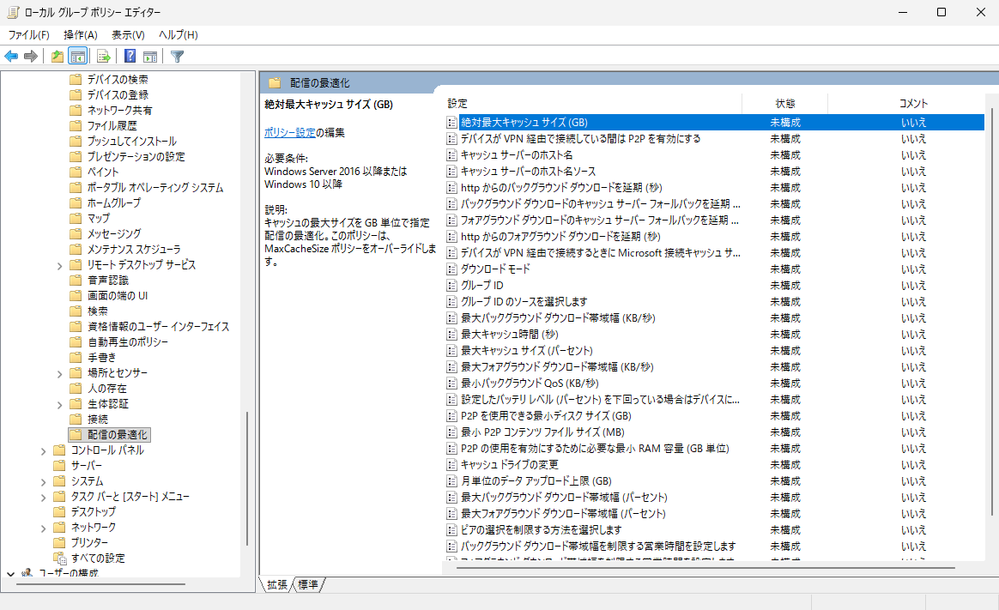
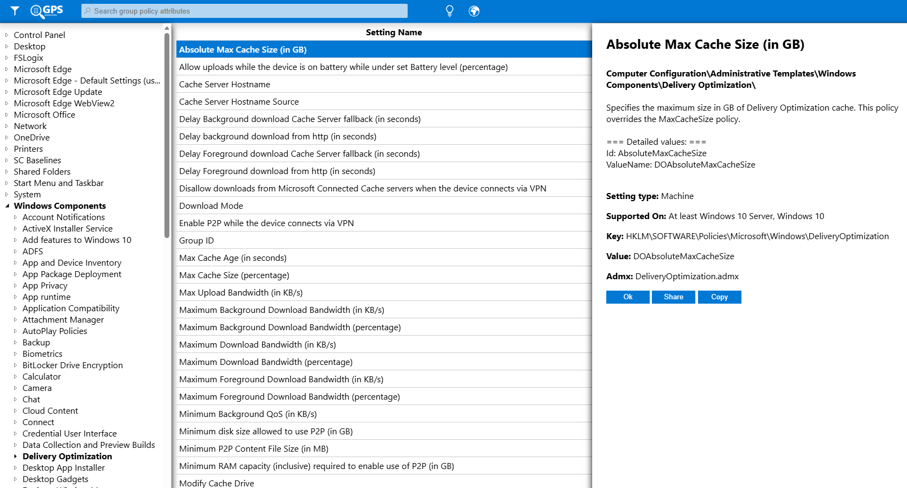
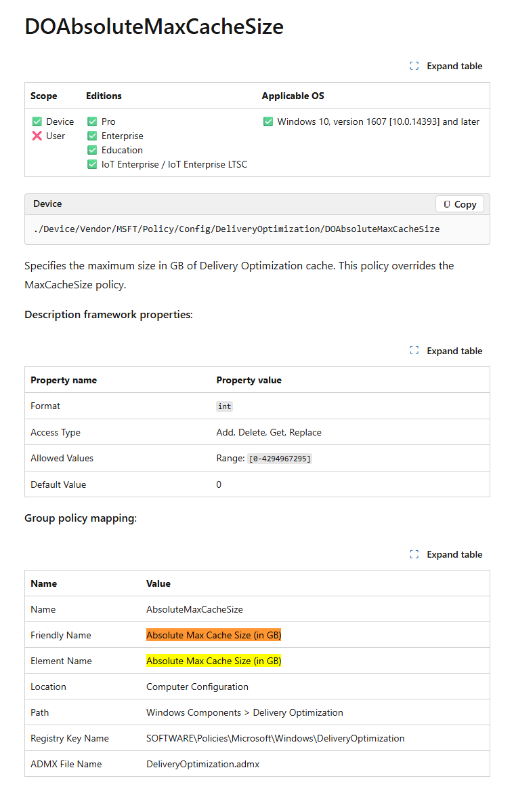
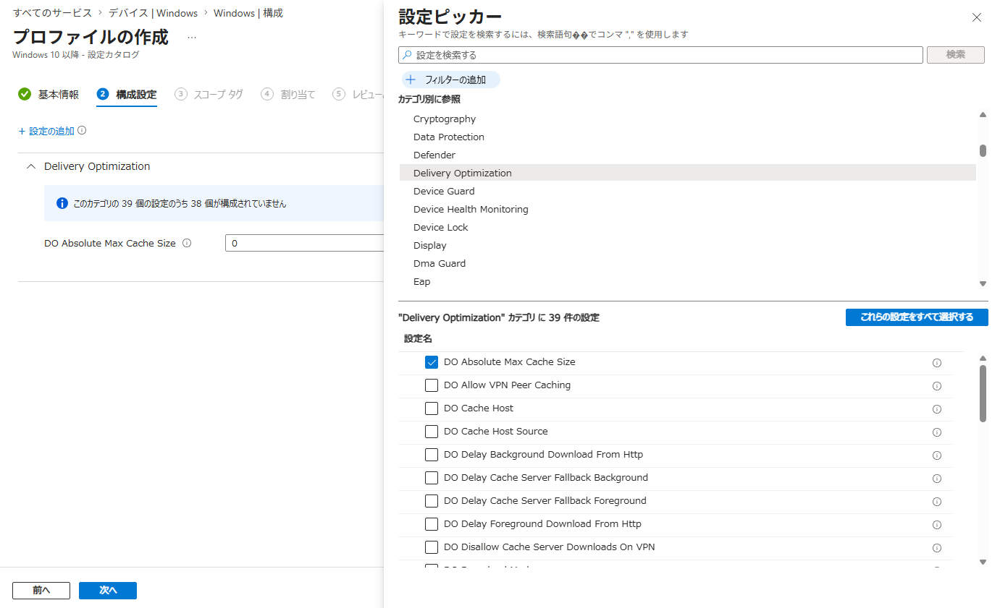
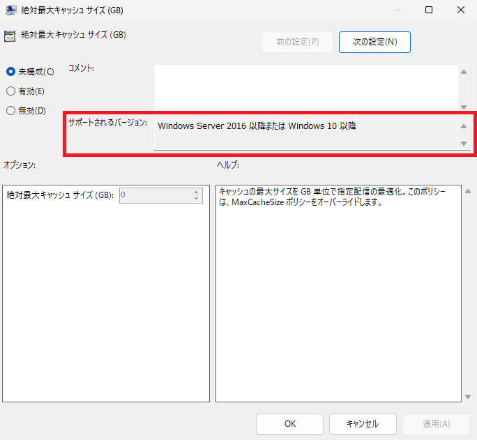

# グループ ポリシーに対応する Intune の設定を見つける方法

みなさま、こんにちは。Intune サポート チームです。

オンプレミスの Active Directory を、これまで利用されてきた多くのお客様がまず直面されるのが「グループ ポリシー (GPO) での設定項目を、Intune ではどう設定すればよいのか？」という疑問ではないでしょうか。

グループ ポリシーで慣れ親しんだ設定を Intune でも同じように配布したいと思っても、Intune の管理センターには膨大な数の設定が存在するため、目的の設定を探し出すのは簡単ではありません。設定名の日本語訳が微妙に異なっていたり、そもそも設定カタログ上での呼び名が違っていたりして、なかなか目的の設定にたどり着けないという声もよくいただきます。

## まずは「グループ ポリシー分析」もご検討ください

既存のグループ ポリシー (GPO) をまとめて Intune へ移行したい場合には、Intune の **「グループ ポリシー分析 (Group Policy analytics)」** という機能がとても便利です。この機能では、オンプレミスでエクスポートした GPO の XML を Intune にインポートすることで、**各設定が Intune (MDM) に対応しているかどうかを自動で分析** してくれます。さらに、対応している設定については、そのまま設定カタログのプロファイルとして移行することも可能です。

- Microsoft Intune を使用してグループ ポリシーをインポートおよび分析する - Microsoft Learn
  https://learn.microsoft.com/ja-jp/intune/device-configuration/import-group-policy-analytics

多数のグループ ポリシーを一括で棚卸し・移行したい場合には、まずはこのグループ ポリシー分析を試していただくのがおすすめです。

## 移行の進め方全体を考えるうえで参考になる記事

また、グループ ポリシーから Intune への移行を「どういう順序・考え方で進めるか」という点については、下記の記事がとても参考になります。

- Group Policy Analytics Framework - Microsoft Community Hub
  https://techcommunity.microsoft.com/blog/coreinfrastructureandsecurityblog/group-policy-analytics-framework/3749480

この記事では、移行を **「Discover (洗い出し)」→「Assess (評価)」→「Migrate (移行)」** の 3 つのフェーズに整理して考えることが提案されています。中でも特に重要なのが「Assess (評価)」のフェーズで、記事内では次のような問いかけが紹介されています。

- そもそも、その グループ ポリシー設定は今でも必要か？
- 必要だとして、それを実現するためのよりモダンな (クラウド向けの) 手段が別に用意されていないか？

グループ ポリシーは長年にわたって設定が積み重なっているケースが多く、中には設定された当時の背景がすでに失われているものや、現在では別の仕組みで実現した方が適切なものも含まれています。**すべてのグループ ポリシーをそのまま Intune へ移行する必要はない** という視点は、移行作業を進めるうえでとても大切なポイントです。移行の検討を始める前に、一度目を通しておくことをお勧めします。

## 今回の記事で扱う内容

一方で、上記のような評価を経て「この設定は Intune へ移行する」と判断した場合や、**特定のグループ ポリシー設定だけをピンポイントで Intune に置き換えたい** という場合には、対応する Intune 上の設定を手作業で特定する必要があります。

そこで今回は、**特定のグループ ポリシーに対応する Intune 上の設定を、ご自身で探し出すための手順**をご紹介します。この流れを一度覚えていただくと、多くのグループ ポリシー設定について、対応する Intune の設定をご自分で特定できるようになりますので、ぜひ参考にしてみてください。

## 全体の流れ

グループ ポリシーに対応する Intune の設定は、大きく次の 3 つのステップで特定していきます。

1. グループ ポリシーの **英語名** を特定する
2. 英語名を元に、対応する **CSP** を特定する
3. CSP を元に、**設定カタログ** 上で対応する設定を見つける

今回は例として、下記のグループ ポリシー設定を Intune で配布したい場合を考えてみます。

> [コンピューターの構成] - [管理用テンプレート] - [Windows コンポーネント] - [配信の最適化] - [絶対最大キャッシュ サイズ (GB)]

それでは、順を追って見ていきましょう。

## ステップ 1. グループ ポリシーの英語名を特定する

まずは、対象となるグループ ポリシーの **英語名** を特定します。

「なぜわざわざ英語名を調べるの？」と思われるかもしれませんが、これには理由があります。日本語の設定名は翻訳のブレがあり、Intune の設定カタログ上の日本語名と、グループ ポリシー上の日本語名が微妙に異なっていることが少なくありません。そのため、英語名を基準に探した方が、確実に対応する設定を見つけることができます。

グループ ポリシーの英語名を調べるには、下記の **Group Policy Search (GPS)** というサイトが便利です。設定のパスを辿っていく方法や、グループ ポリシーで設定されるレジストリ値で検索を行うことで、対応する英語名を確認することができます。

- Group Policy Search (GPS)
  https://gpsearch.azurewebsites.net/

今回の例では [Windows Components (Windows コンポーネント)] - [Delivery Optimization (配信の最適化)] のパスを辿っていくと、[絶対最大キャッシュ サイズ (GB)] に対応する英語名が **Absolute Max Cache Size (in GB)** であることが確認出来ます。

## ステップ 2. 英語名を元に対応する CSP を特定する

次に、特定した英語名を元に、対応する **CSP (Configuration Service Provider)** を探します。CSP とは、Windows OS に対して設定を反映するための仕組みで、Intune はこの CSP を通じて各種設定を配布しています。グループ ポリシーと Intune の設定を結びつける「橋渡し役」とイメージしていただくと分かりやすいかと思います。

対応する CSP を探すには、**「グループ ポリシーの英語名」と「CSP」** をあわせて検索エンジンで検索してみてください。多くの場合、Microsoft の公式ドキュメントである Policy CSP のページが見つかります。

このページには **「Group policy mapping」** という項目があり、その CSP がどのグループ ポリシーに対応しているかが記載されています。ここを確認することで、目的のグループ ポリシーに対応する CSP を正確に特定することができます。

- Policy CSP - DeliveryOptimization / DOAbsoluteMaxCacheSize
  https://learn.microsoft.com/en-us/windows/client-management/mdm/policy-csp-deliveryoptimization#doabsolutemaxcachesize

今回の例では、「絶対最大キャッシュ サイズ (GB)」に対応する CSP が **DeliveryOptimization / DOAbsoluteMaxCacheSize** であることが分かります。

## ステップ 3. CSP を元に設定カタログ上で対応する設定を見つける

最後に、特定した CSP を元に、Intune の **設定カタログ** 上で対応する設定を見つけます。

基本的には、**CSP の名前がそのまま設定カタログ上の設定名として使われている** ため、設定カタログ上でカテゴリとして "Delivery Optimization" を選択すると、目的の設定 "DO Absolute Max Cache Size" を見つけることができます。

### 同じ名前の設定が 2 つ表示される場合

なお、下記のように同じ設定が 2 つ表示されることがあります。これは、その設定を **ユーザー単位** で反映するか、**デバイス単位** で反映するかの違いによるものです。

設定名の後ろに **"(User)"** と付いているものは、ユーザー単位で反映される設定です。グループ ポリシーを触ったことのある方であれば、**「ユーザーの構成」と「コンピューターの構成」の違い** と理解していただければ分かりやすいかと思います。「コンピューターの構成」配下のグループ ポリシーであれば、"(User)" の付いていないデバイス単位の設定を選択します。

## 対応する設定が見つからないときは

上記の手順で多くの設定は見つけられますが、中には対応する設定がなかなか見つからないケースもあります。そのような場合に試していただきたいポイントを、いくつかご紹介します。

### グループ ポリシーの英語名で設定カタログを検索してみる

一部の設定は、CSP 名ではなく **グループ ポリシーの英語名そのまま** の名前で設定カタログ上に存在することがあります。CSP 名で見つからない場合は、ステップ 1 で特定した英語名で設定カタログを検索してみると、見つかることがあります。

### 古いグループ ポリシーでないか確認してみる

グループ ポリシーには、過去のバージョンとの互換性を保つために、かなり古い設定が残されている場合があります。そうした古い設定は、CSP としては対応する設定が用意されていないこともあります。

グループ ポリシーの **「サポートされるバージョン」** を確認し、そもそも現在ご利用の Windows のバージョンでサポートされている設定かどうかを確認してみてください。

### レジストリで代替できないか確認してみる

どうしても対応する設定が見つからない場合は、**スクリプトを利用してグループ ポリシーに対応するレジストリ値を直接設定する** ことで代替できる場合があります。

グループ ポリシーが実際に書き込むレジストリ値は、ステップ 1 でご紹介した Group Policy Search (GPS) で確認することができます。ここで確認したレジストリ値を、Intune の PowerShell スクリプトや Win32 アプリなどを利用して直接設定することで、グループ ポリシーと同等の設定を実現できる場合があります。

- Group Policy Search (GPS)
  https://gpsearch.azurewebsites.net/

レジストリ値を配布する具体的な手段としては、PowerShell スクリプト、修復スクリプト (Proactive Remediation)、Win32 アプリなどが挙げられます。それぞれの使い分けや実装例については、冒頭でご紹介した下記の記事の後半でも触れられていますので、あわせてご覧ください。

- Group Policy Analytics Framework - Microsoft Community Hub
  https://techcommunity.microsoft.com/blog/coreinfrastructureandsecurityblog/group-policy-analytics-framework/3749480

なお、レジストリを直接設定する方法は、グループ ポリシーによる設定とは反映のされ方が異なる場合があります。適用前に、テスト環境で意図した通りに動作するかを十分にご確認いただくことをお勧めします。

## おわりに

今回は、グループ ポリシーに対応する Intune 上の設定を見つける方法として、次の 3 ステップをご紹介しました。

1. グループ ポリシーの **英語名** を特定する
2. 英語名を元に、対応する **CSP** を特定する
3. CSP を元に、**設定カタログ** 上で対応する設定を見つける

この流れを覚えていただくと、多くのグループ ポリシー設定について、対応する Intune の設定をご自身で特定できるようになります。オンプレミスから Intune への移行を進める際や、既存のグループ ポリシーを Intune へ置き換える際に、ぜひ活用してみてください。

それでは、また次回の記事でお会いしましょう。
