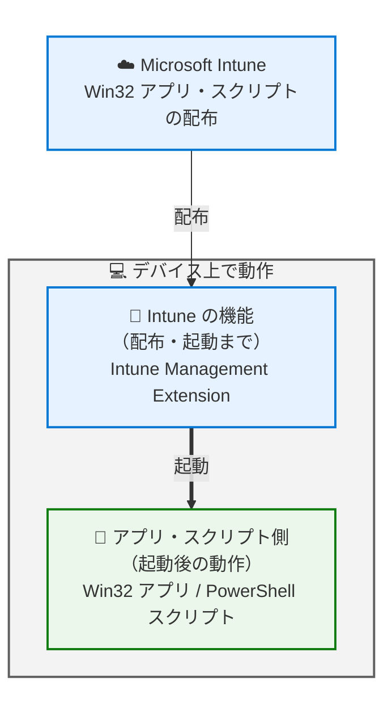
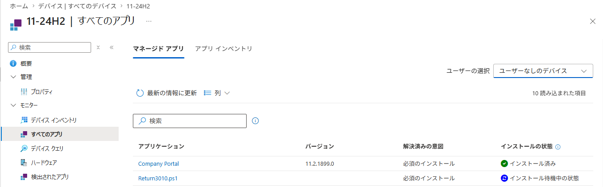
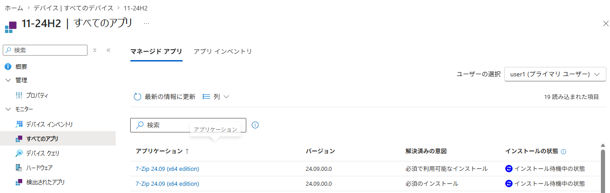

# Intune のトラブル解決が早くなる。知っておきたい "役割分担" - Win32 アプリ編

みなさま、こんにちは。Intune サポート チームです。

以前の記事では、Intune と Windows の "役割分担" という視点から、設定 (CSP) の配布を例にトラブルシューティングの基本的な考え方をご紹介しました。今回はその Win32 アプリ編として、**Intune から Win32 アプリを配布した "後" に、どこをどう確認していけばよいか** を掘り下げてご紹介します。

なお、配布を始める "前" に押さえておきたいポイントについては、下記の記事にまとめています。あわせてご覧いただくと、より効果的に運用いただけます。

- 意外と見落としがち？ Intune で Win32 アプリを配布する前に確認しておきたいポイント
  https://jpintune.github.io/blog/intune/20260728_01/

上記の記事でも紹介している通り、配布後の切り分けに入る前に、まずは **Intune が実際にインストール コマンドを実行するのと同じ条件で動作を確認しておく** ことで、多くの問題は未然に防げます。システム コンテキスト / ユーザー コンテキストのどちらで実行されるか、32 ビット / 64 ビットのどちらのプロセスになるか。この条件がずれていると、手元では成功するのに Intune から配布すると失敗する、といったすれ違いが起きてしまいます。システム コンテキストで確認したい場合に便利な [PsExec](https://learn.microsoft.com/ja-jp/sysinternals/downloads/psexec) の使い方も上記の記事でご紹介していますので、本記事を読み進める前に、ご自身のアプリがどちらの条件で実行されるのかを把握しておくとスムーズです。

## はじめに ― どこまで調べるかを決めておく

トラブルシューティングを始める前に、ぜひ一度立ち止まって考えていただきたいことがあります。それは、**どの程度の規模の問題に対して、詳細な調査を行うか** をあらかじめ決めておく、という点です。

Win32 アプリの配布では、クライアントごとに少しずつ環境が異なることから、一部のデバイスでのみ問題が発生することがあります。ログ調査は相応の時間と手間がかかるため、ごく少数のデバイスで起きる事象に対して、いきなり本格的な調査に踏み込むのは必ずしも得策ではありません。

小規模な事象であれば、次のような対処で解決してしまうことも少なくありません。

- 対象のデバイス上で、アプリのインストーラーを手動で実行してみる
- 「必須」として割り当てているアプリであれば、24 時間に一度リトライが行われるため、少し時間を置いて状況を確認する

Intune はクライアント デバイスを管理するという性質上、どうしても管理対象の台数が多くなります。だからこそ「そもそも細かくトラブルシューティングを行うべき事象なのか」という視点を持っておくと、運用全体の負荷をぐっと抑えられます。

### なぜ「切り分け」が大切なのか

そのうえで、実際に調査が必要となった場合に大きな武器になるのが「切り分け」です。

Win32 アプリの配布は、Intune だけで完結しているわけではありません。Intune はアプリを **「デバイスに届けて、インストール コマンドを起動する」** ところまでを担当し、そこから先の実際のインストール処理は、**アプリのインストーラー自身** にバトンタッチされます。

この役割分担を理解しておくと、次のようなメリットがあります。

- 確認すべきログやポイントを最初から絞り込めるため、調査がスムーズに進む
- 原因がアプリ側にあると早い段階で分かれば、アプリの提供元へ的確に相談できる
- ご自身で解決できるケースも多く、待ち時間なく対処できる

「Intune の問題なのか、それともアプリのインストーラーの問題なのか」。この一点を見極められるようになるだけで、解決までの時間は大きく変わってきます。

## Win32 アプリの配布の仕組み

まずは全体像を押さえておきましょう。Intune から Win32 アプリを配布したときの流れは、次の図のようになります。



Intune がクラウドからアプリのコンテンツと設定を配布し、デバイス上の Intune Management Extension (以下、IME) がそれを受け取ってインストール コマンドを起動します。そして、起動された後のインストール処理そのものは、アプリのインストーラー側の担当範囲です。

この IME は、Win32 アプリや PowerShell スクリプトの配布を担う Intune 専用のエージェントで、対象のデバイスへ自動的にインストールされます。インストールされる条件や前提となる要件については、下記の公開情報にまとめられていますので、一度目を通しておくと切り分けの際に役立ちます。

- Microsoft Intune 管理拡張機能について
  https://learn.microsoft.com/ja-jp/intune/device-management/tools/management-extension-windows

したがって、IME のログから分かるのは、おおむね次の 2 点になります。

- インストール コマンドのプロセスを **起動できたかどうか**
- そのプロセスが **どのような終了コードを返したか**、そして **検出規則を満たしたかどうか**

逆に言えば、「インストーラーが内部で何をして、なぜ失敗したのか」は Intune 側のログからは見えません。ここが、切り分けの大きな分岐点になります。

## Win32 アプリが配布されているかを確認する方法

それでは、実際の確認方法を見ていきましょう。確認の入り口は大きく 2 つあります。

### 1. Intune 管理センターからの確認方法

まずは Intune 管理センターです。下記の画面から、デバイスごとのアプリのインストール状況を確認できます。

`[デバイス]` - `[すべてのデバイス]` - `[<確認対象のデバイス>]` - `[すべてのアプリ]`



ここで一点、注意していただきたいのが画面右上の `[ユーザーの選択]` です。アプリのインストール状況は **ユーザーごとに評価** が行われます。そのため、対象のデバイスに最近ログインしておらず、そのユーザーで評価が行われていないアプリを選択すると、次のように `[インストールの待機中]` と表示されることがあります。



「エラーは出ていないのに、いつまでも待機中のまま」という場合は、まず選択しているユーザーが適切かどうかを確認してみてください。

### 2. デバイス上のログからの確認方法

管理センター上でエラーが確認できた場合や、より詳しい状況を知りたい場合は、デバイス上のログを確認します。

IME のログは、下記のフォルダー配下に出力されます。Win32 アプリの配布においては、特に `AppWorkload.log` が重要です。

```
C:\ProgramData\Microsoft\IntuneManagementExtension\Logs
```

これらのログは、Intune 管理センターからリモートで収集できる診断情報にも含まれています。手元にデバイスがない場合でも、デバイスと Intune の通信ができていれば、下記の方法で収集が可能です。

- デバイス アクション: 診断を収集する
  https://learn.microsoft.com/ja-jp/intune/device-management/actions/collect-diagnostics?tabs=reg&pivots=windows

ここからは、切り分けに重要なポイントをログから確認する方法をご紹介します。

#### 事前準備 : Win32 アプリの ID を確認する

ログを見るときは、あらかじめ対象の Win32 アプリの ID を控えておくと格段に効率が上がります。`AppWorkload.log` には複数のアプリの処理が混在して出力されるため、この ID で絞り込むことで、目的のアプリのログだけを追えるようになります。

Win32 アプリの ID は、Intune 管理センターで下記の画面を開いたときの URL から確認できます。

`[アプリ]` - `[すべてのアプリ]` - `[<確認対象のアプリ>]`

URL の末尾に GUID 形式で表示されているものが、対象の Win32 アプリの ID です。

URL の例
```
https://intune.microsoft.com/#view/Microsoft_Intune_Apps/SettingsMenu/~/0/appId/<Win32 アプリの ID>
```

#### インストール コマンドが実際に IME から実行されているか確認する

まず確認したいのが、インストール コマンドのプロセスが IME から正しく起動されているかどうかです。`AppWorkload.log` には、次のようなログが出力されます。

ログの出力例
```
<![LOG[[Win32App] ===Step=== InstallBehavior RegularWin32App, Intent 3, UninstallCommandLine <アンインストール コマンド>]LOG]!><time="09:20:57.1814617" date="7-20-2026" component="AppWorkload" context="" type="1" thread="94" file="">
<![LOG[<インストール コマンド>]LOG]!><time="09:20:57.2014614" date="7-20-2026" component="AppWorkload" context="" type="1" thread="94" file="">
<![LOG[[Win32App] SetCurrentDirectory: C:\WINDOWS\IMECache\<Win32 アプリの ID>_1]LOG]!><time="09:20:57.2024637" date="7-20-2026" component="AppWorkload" context="" type="1" thread="94" file="">
<![LOG[[Win32App] Launch Win32AppInstaller in machine session]LOG]!><time="09:20:57.2034684" date="7-20-2026" component="AppWorkload" context="" type="1" thread="94" file="">
<![LOG[[Win32App] lastWin32Error 0 after CreateProcess]LOG]!><time="09:21:31.2586296" date="7-20-2026" component="AppWorkload" context="" type="1" thread="94" file="">
<![LOG[[Win32App] lastHResult -2147024896 after CreateProcess]LOG]!><time="09:21:31.2596312" date="7-20-2026" component="AppWorkload" context="" type="1" thread="94" file="">
<![LOG[[Win32App] Create installer process successfully.]LOG]!><time="09:21:31.2596312" date="7-20-2026" component="AppWorkload" context="" type="1" thread="94" file="">
<![LOG[[Win32App] process id = 8673]LOG]!><time="09:21:31.2596312" date="7-20-2026" component="AppWorkload" context="" type="1" thread="94" file="">
...
<![LOG[[Win32App] Installation is done, collecting result]LOG]!><time="09:22:13.4593834" date="7-20-2026" component="AppWorkload" context="" type="1" thread="94" file="">
<![LOG[[Win32App] lpExitCode 0]LOG]!><time="09:22:13.4603777" date="7-20-2026" component="AppWorkload" context="" type="1" thread="94" file="">
<![LOG[[Win32App] hResultFromWin32 0]LOG]!><time="09:22:13.4613821" date="7-20-2026" component="AppWorkload" context="" type="1" thread="94" file="">
<![LOG[[Win32App] Set EnforcementStateMessage.ErrorCode 0]LOG]!><time="09:22:13.4613821" date="7-20-2026" component="AppWorkload" context="" type="1" thread="94" file="">
<![LOG[[Win32App] lpExitCode is defined as Success]LOG]!><time="09:22:13.4633813" date="7-20-2026" component="AppWorkload" context="" type="1" thread="94" file="">
```

ここでの確認ポイントは 2 つです。

**1 つ目は、インストール コマンドのプロセスが IME から正常に起動されているか。** 上記の例では `Create installer process successfully.` が出力されていることから、インストール コマンドのプロセスが IME から問題なく起動されたことが分かります。あわせて、その少し前に出力されているインストール コマンドの内容も確認しておくと、意図したコマンドが実行されているかを確かめられます。

**2 つ目は、インストール コマンドが想定どおりの終了コード (`lpExitCode`) を返しているか。** 上記の例では `lpExitCode 0` と出力されており、インストール コマンドから終了コードとして `0` が返されたことが分かります。続く `lpExitCode is defined as Success` から、その終了コードが成功として扱われたことも読み取れます。

なお、`lpExitCode` に想定されない値 (`1` など) が返されている場合、**Intune 側のログからこれ以上の詳細を確認することはできません。** これは、Intune の役割がインストール コマンドを起動して結果を受け取るところまでであり、「なぜその終了コードになったのか」はインストーラー自身しか知り得ないためです。

このようなときは、インストール コマンドの実行時に出力されるアプリのインストーラーのログを確認したり、アプリの提供元のサポート窓口へ、その終了コードの意味を確認してみるとよいでしょう。多くのインストーラーは、終了コードごとの意味をドキュメントで公開しています。

#### 検出規則の判定状況を確認する

もう 1 つの重要な確認ポイントが、検出規則の判定状況です。検出規則の評価についても、次のようなログが出力されます。

ログの出力例
```
<![LOG[[Win32App][DetectionActionHandler] Detection running for policy with id: <Win32 アプリの ID>.]LOG]!><time="09:22:28.6546377" date="7-20-2026" component="AppWorkload" context="" type="1" thread="94" file="">
...
<![LOG[[Win32App] Start detectionManager SideCarRegistryDetectionManager]LOG]!><time="09:22:28.6576382" date="7-20-2026" component="AppWorkload" context="" type="1" thread="94" file="">
<![LOG[[Win32App]  Got reg value path: HKEY_LOCAL_MACHINE\SOFTWARE\Test\Agent, name: Installversion, value: 1.0.0]LOG]!><time="09:22:28.6596374" date="7-20-2026" component="AppWorkload" context="" type="1" thread="94" file="">
<![LOG[[Win32App] Equal: actualValue: 1.0.0, DetectionValue: 1.0.0, applicationDetected: True]LOG]!><time="09:22:28.6596374" date="7-20-2026" component="AppWorkload" context="" type="1" thread="94" file="">
<![LOG[[Win32App] Checked reg path: HKEY_LOCAL_MACHINE\SOFTWARE\Test\Agent, name: Installversion, operator: 1, type: 3, value: 1.0.0 , result of applicationDetected: True]LOG]!><time="09:22:28.6610302" date="7-20-2026" component="AppWorkload" context="" type="1" thread="94" file="">
<![LOG[[Win32App] detectionManager SideCarRegistryDetectionManager got applicationDetectedByCurrentRule: True as system]LOG]!><time="09:22:28.6615404" date="7-20-2026" component="AppWorkload" context="" type="1" thread="94" file="">
<![LOG[[Win32App] Completed detectionManager SideCarRegistryDetectionManager, applicationDetectedByCurrentRule: True]LOG]!><time="09:22:28.6615404" date="7-20-2026" component="AppWorkload" context="" type="1" thread="94" file="">
<![LOG[[Win32App][ReportingManager] Detection state for app with id: <Win32 アプリの ID> has been updated. Report delta: {"DetectionState":{"OldValue":"NotInstalled","NewValue":"Installed"}}]LOG]!><time="09:22:28.6645546" date="7-20-2026" component="AppWorkload" context="" type="1" thread="94" file="">
```

上記の例では、レジストリを利用した検出規則が評価されています。`Got reg value path:` の行で、IME が実際に読み取ったレジストリのパス・名前・値が出力され、続く `Equal: actualValue: 1.0.0, DetectionValue: 1.0.0, applicationDetected: True` の行で、検出規則に指定した値 (`DetectionValue`) と、デバイス上の実際の値 (`actualValue`) を比較した結果が確認できます。そして最後に、検出状態が `NotInstalled` から `Installed` に更新されたことが記録されています。

このように、**指定した検出規則によってアプリが検出されたのかどうか** を、ログから追うことができます。

検出規則が満たされなかった場合、Intune はインストール コマンドが正常に完了しなかったものとして、エラー `0x87D1041C` (`-2016345060`) と判定します。ここで大切なのは、**終了コードが成功でも、検出規則が満たされなければアプリは「失敗」として扱われる** という点です。

検出規則が満たされていないことが分かった場合は、デバイス上で実際に検出規則に指定したレジストリやファイルなどを確認してみてください。現時点で検出規則が満たされているかを直接確かめられます。ログ上の判定結果と食い違う場合は、次のような点を疑ってみるとよいでしょう。

- パスや値の指定がわずかに間違っている (余分な空白、`WOW6432Node` 配下との取り違え など)
- タイミングの問題で、判定時点ではまだ目印が作られていない

とくに後者は見落としがちなポイントです。検出規則の評価はインストール コマンドの **完了直後** に行われるため、「インストール完了からしばらく経たないと作成されないファイル」や「一度アプリを起動しないと現れない値」を目印にしていると、実際にはインストールが成功していても `0x87D1041C` (`-2016345060`) と判定されてしまいます。このような場合は、より適切な検出規則がないか、アプリの提供元に相談してみるのがおすすめです。提供元は、インストール完了時にどのファイルやレジストリ値が確実に作成されるかを最もよく把握しています。

なお、**インストール コマンドが実行されていない場合にも、検出規則の処理を確認してみるとヒントが隠れている** ことがあります。Intune は、検出規則が既に満たされている環境に対してはアプリの配布を行いません。「いつまでもインストールが始まらない」という場合、実は既に検出規則が満たされていた、というのもよくあるパターンです。

## Intune から Win32 アプリの配布が確認できないときの簡単な切り分け手順

ログを確認しても、そもそも対象のアプリに関する処理がまったく記録されていない。そんなときに試していただきたい、簡単な切り分け手順をご紹介します。

### ネットワーク環境の確認

Intune および IME は、いくつかのエンドポイントと通信できることを前提に動作します。まずは、必要なエンドポイントとの通信が許可されているかを確認してみてください。

- Microsoft Intune のネットワーク エンドポイント
  https://learn.microsoft.com/ja-jp/intune/fundamentals/endpoints

プロキシや VPN をご利用の場合は、一時的にそれらを経由しないネットワークに接続して事象が変わるかを確認したり、別のネットワークにつないで比較してみたりするのも有効な切り分けです。

### Microsoft Intune Management Extension サービスの再起動

IME は、サービスの起動タイミングで新しい Win32 アプリが存在しないかを Intune へ確認しに行きます。そのため、すぐに配布を始めたい場合は、サービスの再起動が有効な切り分けになります。

管理者権限を持つユーザーであれば、スタート メニューから `services.msc` を起動し、`Microsoft Intune Management Extension` を右クリックして再起動できます。再起動後に `AppWorkload.log` に新しいログが出力され始めるかを確認してみてください。

### Entra ID ユーザーで Windows 上にログインする

これは、ユーザー グループに割り当てているアプリや、インストール コンテキストとして「ユーザー」を選択しているアプリの場合の確認ポイントです。

Intune 上でユーザー グループに割り当てているアプリや、インストール コンテキストとしてユーザーを選択しているアプリは、**そのユーザーがデバイス上にログインしていないと配布が行われません。**

「割り当てているのに一向に配布が始まらない」という場合は、対象のユーザーで実際にログインできているかもあわせて確認してみましょう。

## 「これは Intune？ それともアプリのインストーラー？」― 事象別の考え方

ここまでの内容を踏まえて、どのような事象がどちら側の調査対象になるのかを整理してみましょう。考え方はシンプルです。

- **アプリがデバイスに "届く" までに関すること** → Intune の観点から確認
- **インストール コマンドが起動された "後" の動作に関すること** → アプリのインストーラーの観点から確認

### Intune 側に焦点を当てて確認するとよい事象

- Win32 アプリのインストール処理や、検出規則による判定が行われている形跡がログから確認できない
- Intune 上では割り当てをしているにもかかわらず、なかなか配布が進まない
- Win32 アプリの実際の配布状況と、Intune 管理センター上のレポートに差異がある

### アプリのインストーラーに焦点を当てて確認するとよい事象

- `lpExitCode` が想定している値ではない
- `lpExitCode` は `0` であるにもかかわらず、検出規則が満たされず `0x87D1041C` (`-2016345060`) エラーが発生する
- Intune から配布した後に、配布したアプリが起動しない、または期待どおりに動作しない

後者に該当する場合は、アプリのインストーラーが出力するログを確認し、必要に応じてアプリの提供元のサポート窓口へ相談してみると良いでしょう。インストーラーの内部の動作を最もよく把握しているのは提供元です。「Intune から配布した際に、終了コード `<値>` が返り、インストールが完了しなかった」といった形で、IME のログから読み取った事実をあわせてお伝えいただくと、スムーズにご相談いただけます。

## おわりに

今回は、Win32 アプリを配布した後のトラブルシューティングについて、"役割分担" という視点からご紹介しました。

- Intune (IME) の担当範囲は、アプリを配布し、インストール コマンドを **起動するところまで**
- IME のログから分かるのは、**プロセスを起動できたか**・**終了コードは何か**・**検出規則を満たしたか** の 3 点
- 終了コードが想定外の値になる理由や、インストール処理そのものの詳細は、**アプリのインストーラーのログ** から確認する

「どこまでが Intune で、どこからがアプリなのか」。この線引きを意識しておくだけで、問題が起きたときに最初に見るべき場所がはっきりし、解決までの時間はぐっと短くなります。ぜひ日々の運用に取り入れてみてください。

次回以降も、みなさまの運用に役立つ情報をお届けしていきます。最後までお読みいただき、ありがとうございました。
