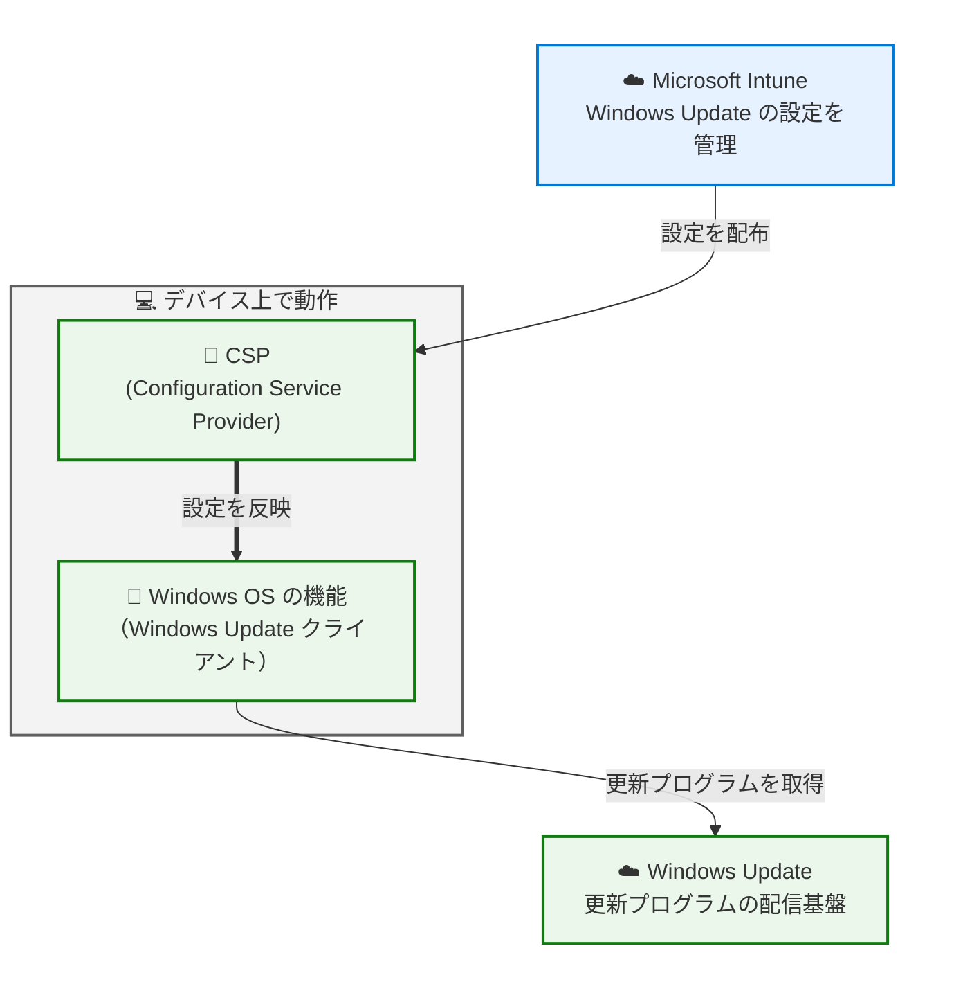
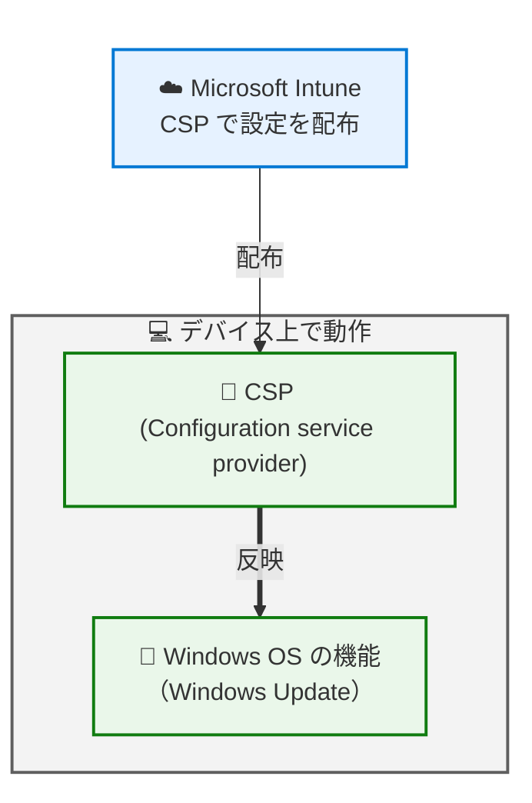
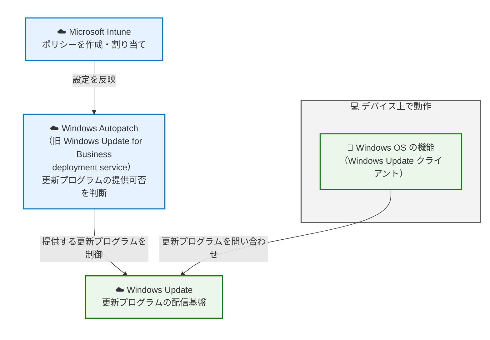
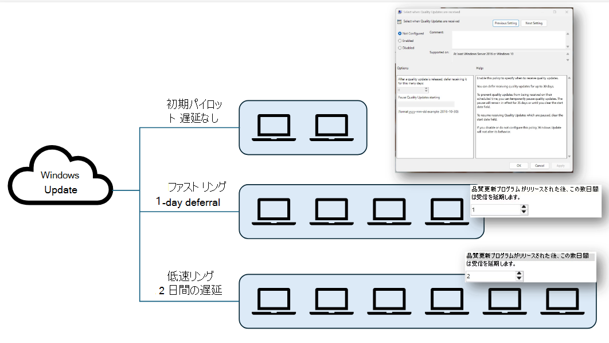
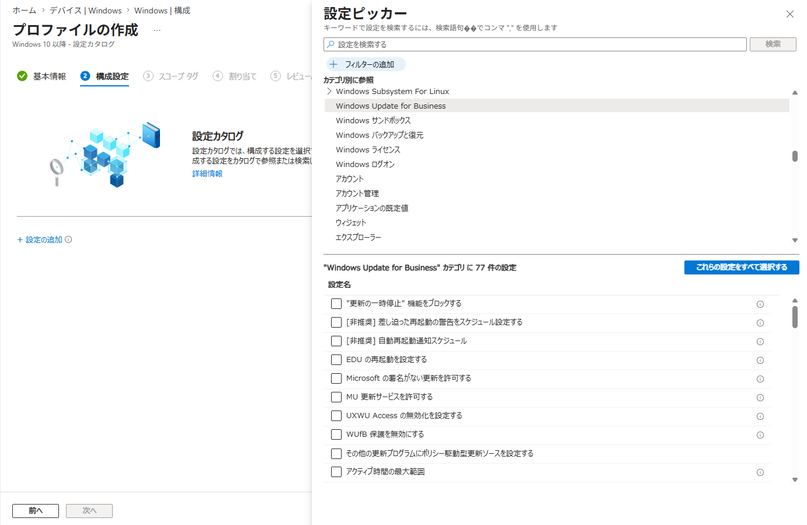
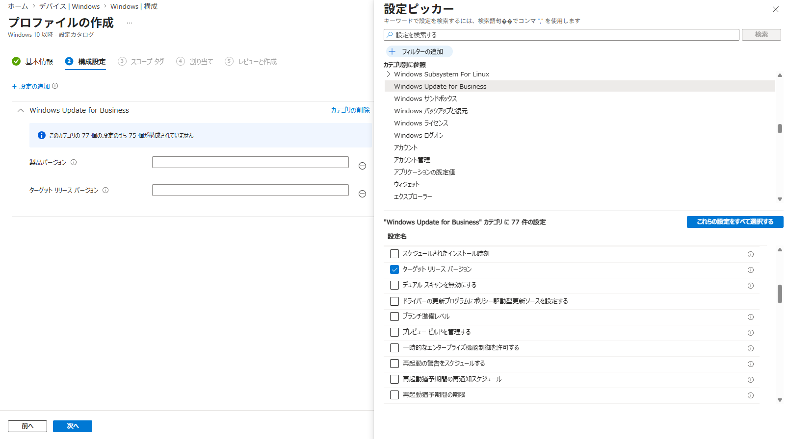

# Intune で Windows Update を管理するポリシーの使い分け

みなさま、こんにちは。Intune サポート チームです。

Intune も年々進化を続けており、Windows Update に関連するポリシーもずいぶんと種類が増えてきました。「更新リング」「設定カタログ」「機能更新プログラム ポリシー」「品質更新プログラム ポリシー」…と管理センターに並ぶ選択肢を前にして、**「結局、どのポリシーを使えばよいの？」** と迷われた経験はないでしょうか。

実はこれらのポリシーは、それぞれ想定している用途や、内部的な仕組みが少しずつ異なっています。逆に言えば、**それぞれの役割と裏側の仕組みを押さえておけば、ご自身の運用に合ったポリシーを自信を持って選べるようになります**。設定が思ったように反映されない、期待した更新プログラムが降ってこない、といったモヤモヤの多くも、この理解があるだけでスッと解消できることが少なくありません。

そこで今回は、Intune で Windows Update を管理する際の各ポリシーについて、**どのような目的で使うものなのか**、そして**どう使い分けるとよいのか**を、ひと通りご紹介していきます。

## はじめに ― 押さえておきたい 3 つの前提

具体的な各ポリシーの説明に入る前に、知っておいていただくと理解が進む前提を、いくつかご紹介します。

### ① Intune は Windows Update の "配信基盤" を持っているわけではない

まず一つ目、これが最も大切なポイントかもしれません。それは、**Intune 自体は Windows Update 専用の配信基盤や仕組みを持っているわけではない**、という点です。

Intune で Windows Update の設定を管理することはできますが、更新プログラムの適用の動作や、更新プログラムそのものの配信基盤は、**通常の Windows OS とまったく同じ仕組み**が用いられています。Intune が独自の Windows Update 管理エージェントを常駐させていたり、更新プログラムを配信するための専用のサイトを持っていたり、というわけではないのです。

つまり Intune が担当するのは「**どのように更新するか、という設定をデバイスに届けるところまで**」であり、実際に更新プログラムをダウンロードして適用するのは Windows OS 側の役目、という役割分担になっています。この視点は、Intune と Windows の "役割分担" として下記の記事でもご紹介していますので、あわせてご覧いただくとより理解が深まります。

- Intune のトラブル解決が早くなる。知っておきたい Windows との "役割分担" - 基本編
  https://jpintune.github.io/blog/intune/20260722_02/

この役割分担が頭に入っていると、「更新プログラムが適用されない」という事象に出会ったときにも、**設定が正しく配布されているかを確認するフェーズ**と、**配布された設定に沿って Windows Update が動作しているかを確認するフェーズ**とを分けて考えられるようになり、切り分けが一気にスムーズになります。

### ② ポリシーは大きく 2 種類に分けられる

二つ目のポイントです。Intune で Windows Update を設定できる主なプロファイルはいくつもありますが、内部的な仕組みで整理すると、実は次の 2 種類に分けられます。

- **Windows Update クライアント ポリシー (CSP) によって管理される設定**
  - 更新リング
  - 設定カタログ

- **クラウド上の Windows Autopatch によって管理される設定**
  - 機能更新プログラム ポリシー
  - 品質更新プログラム ポリシー
  - 品質更新プログラムの迅速化 (Expedite) ポリシー
  - ドライバー更新プログラム ポリシー

このどちらに属するポリシーなのかを意識しておくと、設定の確認方法や、反映されるまでの考え方が整理しやすくなります。順に見ていきましょう。

#### Windows Update クライアント ポリシー (CSP) によって管理される設定

こちらは、これまでオンプレミスでグループ ポリシーを使って Windows Update を管理されてきたお客様には、比較的馴染みやすい仕組みです。

Intune は、グループ ポリシーに相当する **CSP (Configuration Service Provider)** と呼ばれる設定をデバイスへ配信します。デバイス上に設定が反映された後は、Windows OS がその設定に沿って Windows Update を実施する、というシンプルな流れになります。

設定はデバイス上のレジストリに反映されるため、**「意図した設定が本当にデバイスへ届いているか」を、デバイス上で直接確認できる**のが大きな特徴です。

#### クラウド上の Windows Autopatch によって管理される設定

一方、こちらは従来の管理の仕組みとは少し毛色が異なります。特に、これまでオンプレミスでデバイスを管理されてきたお客様にとっては、最初は少し捉えにくいかもしれません。

この仕組みでは、**設定がデバイス上に直接反映されるわけではありません**。Intune で作成したポリシーの内容は、まずクラウド上の別のサービスである **Windows Autopatch** (以前は Windows Update for Business deployment service と呼ばれていました) に反映されます。そして、デバイスが Windows Update に更新プログラムを問い合わせた際に、Windows Autopatch 側で保持している設定に沿って更新プログラムが提供される、という流れになります。

ここで押さえておきたいのが、**クラウド側での制御になるため、これまでのようにデバイス上のレジストリから設定の反映状況を確認できない場合が多い**、という点です。「設定したはずなのに、デバイス上のレジストリに何も書かれていない」と驚かれることがありますが、こうした仕組みによるものですのでご安心ください。

逆に言えば、**従来どおりレジストリで反映状況を確実に確認したい**というご要望がある場合には、後ほどご紹介するように、CSP によって管理する設定を選ぶ、という方針を取ることもできます。どちらが優れているかではなく、**運用スタイルに合った方を選んでいただく**のも一つの手法です。

##### 補足: Windows Autopatch について

本記事では Windows Autopatch そのものについては深くは触れません。ただ、Windows Autopatch も内部的には更新リングをはじめとする Intune の機能に依存している部分が多いため、Windows Autopatch をご利用のお客様にとっても、本記事の内容は参考にしていただけるかと思います。

- Windows Autopatch とは?
  https://learn.microsoft.com/ja-jp/windows/deployment/windows-autopatch/overview/windows-autopatch-overview

なお、Windows Autopatch は、現時点 (2026 年 8 月現在) では日本語でのサポート サービスは提供されておらず、お問い合わせは英語もしくは機械翻訳での対応となります、ご注意ください。

### ③ 割り当ては「デバイス グループ」が基本

三つ目は、割り当て先のグループについてです。

「機能更新プログラム ポリシー」「品質更新プログラム ポリシー」以外のポリシーについては、**ユーザー グループへ割り当てること自体は可能**です。しかし、Windows Update はそもそも**デバイス単位で実行される**ものですので、多くの場合は**デバイス グループへ割り当てていただいた方が、意図した効果を得やすくなります**。

ユーザー グループに割り当てた場合、ユーザーがサインインするまで設定が適用されなかったり、共有デバイスなどで意図しない動作につながってしまう可能性があります。特別な理由がない限りは、デバイス グループへの割り当てをご検討ください。

## 各ポリシーの紹介

それでは、ここからは各ポリシーについて具体的に見ていきましょう。

### 更新リング

**更新リング**は、Windows Update の設定を行う際に一般的に利用する CSP を、まとめて管理できるプロファイルです。配信される具体的な設定の一覧については、下記の公開情報でご紹介しています。

- 更新リングのポリシー設定
  https://learn.microsoft.com/ja-jp/intune/device-updates/windows/ref-update-ring-settings

更新リングでは、これらの設定に加えて、更新プログラムの一時停止といった機能も備えています。**「Intune で Windows Update の構成を管理するなら、まずはこれ！」** という基本のプロファイルとお考えいただくとよいでしょう。

#### そもそも「リング」とは？

ちなみに「リング」という概念自体は Intune 独自のものではなく、Windows Update において提唱されている考え方です。具体的なイメージは、下記の公開情報の図が分かりやすいかと思います。

- チュートリアル: グループ ポリシーを使用して Windows Update クライアント ポリシーを構成する
  https://learn.microsoft.com/ja-jp/windows/deployment/update/waas-wufb-group-policy

Windows 10 以降、OS の更新プログラムは累積形式で提供されるようになりました。そのため、**個別の更新プログラムを一つひとつ選んで配信を制御する**というより、**デバイスを「リング」という単位にグループ化し、更新プログラムを適用するタイミングをずらしていく**、という考え方が基本になります。

たとえば、まずは検証用のリングで少数のデバイスに早めに適用して問題がないことを確認し、その後、一般ユーザー向けのリング、最後に業務影響の大きい重要な部門のリング、といった具合に段階的に展開していきます。こうすることで、万が一問題が生じた場合でも影響範囲を最小限に抑えつつ、全社的にはきちんと更新プログラムを適用していくことができます。

Intune の更新リングも、こうした Windows Update の考え方に沿って構成を管理できるように用意されているポリシーです。ですので、**まずは「どのようなリング構成にするか」を設計し、それを更新リングのポリシーとして表現していく**、という進め方をしていただくと、無理なく運用に乗せていくことができます。

### 設定カタログ

**設定カタログ**では、更新リングのプロファイルには用意されていない CSP についても、個別に配信することができます。具体的には、設定カタログの **[Windows Update for Business]** 配下にある設定が、主な Windows Update 関連の設定となります。

- Intune の設定カタログを使用して設定を構成する
  https://learn.microsoft.com/ja-jp/intune/device-configuration/settings-catalog

更新リングだけでは設定が不足する場合に、**更新リングを補う形で設定カタログを併用する**、という使い方が一般的です。

Windows Update 関連で OS 側に用意されている CSP については、下記の公開情報でご紹介していますので、こちらもぜひ参考にしてみてください。

- ポリシー CSP - Update
  https://learn.microsoft.com/ja-jp/windows/client-management/mdm/policy-csp-update

なお、あるグループ ポリシーに対応する Intune の設定を探す方法については、下記の記事でご紹介しています。「オンプレミスで設定していたあの項目を Intune でも設定したい」という場合には、こちらもあわせてご覧ください。

- グループ ポリシーに対応する Intune の設定を見つける方法
  https://jpintune.github.io/blog/intune/20260803_01/

### 機能更新プログラム ポリシー

**機能更新プログラム ポリシー**を利用することで、Windows OS に特定のバージョンの機能更新プログラムを配信したり、特定のバージョンより先にアップグレードが行われないよう制御したりすることが可能です。

- Windows 機能更新プログラムを管理する
  https://learn.microsoft.com/ja-jp/intune/device-updates/windows/manage-feature-updates

更新リングの設定でも「機能更新プログラムが配信されるまでの日数」を指定することはできますが、これはあくまで**適用を先延ばしにする**設定であり、期間が過ぎれば新しいバージョンが提供されます。**特定のバージョンに固定し続けたい**という場合には、機能更新プログラム ポリシーをご利用ください。

#### 機能更新プログラム ポリシーを使わずに Windows OS のバージョンを制御できる？

記事の冒頭でご紹介したとおり、機能更新プログラム ポリシーは内部的にはクラウド上の Autopatch で設定が管理されます。そのため、これまでグループ ポリシーや CSP を利用して管理されてきたお客様にとっては、**デバイス上のレジストリから設定内容を確認できない**など、従来とは勝手が異なる部分が出てきます。

「これまでどおり、レジストリで反映状況を確実に確認しながら運用したい」ということであれば、**設定カタログから下記の CSP を配信することでも、バージョンの管理は可能**です。従来に近い管理の仕方を続けたい場合には、機能更新プログラム ポリシーではなく、設定カタログでこれらの設定を配信することを検討してみてもよいでしょう。

- ポリシー CSP - Update / TargetReleaseVersion
  https://learn.microsoft.com/ja-jp/windows/client-management/mdm/policy-csp-update#targetreleaseversion

- ポリシー CSP - Update / ProductVersion
  https://learn.microsoft.com/ja-jp/windows/client-management/mdm/policy-csp-update#productversion

### 品質更新プログラム ポリシー

**品質更新プログラム ポリシー**は、**ホットパッチ**を有効にするためのポリシーです。

ホットパッチは、再起動を伴わずに品質更新プログラムを適用できる仕組みで、ユーザーの再起動の頻度を減らしつつ、セキュリティ更新を適用していくことができます。名前から「品質更新プログラム全般を管理するポリシー」と受け取られることがありますが、**用途はホットパッチの有効化**ですので、その点はご注意ください。

利用にあたっては、対象となる Windows のエディションやバージョン、プロセッサ アーキテクチャなどの前提条件がありますので、下記の公開情報をご確認のうえでご検討ください。

- Windows 品質更新プログラムのホットパッチ
  https://learn.microsoft.com/ja-jp/intune/device-updates/windows/configure-hotpatch

なお、ホットパッチについて、品質更新プログラム ポリシーを利用しなくとも、現在は Autopatch のテナント設定で、テナント全体で既定で有効にすることも可能となっています。

### 品質更新プログラムの迅速化 (Expedite) ポリシー

**品質更新プログラムの迅速化 (Expedite) ポリシー**は、これまでのポリシーとは少し異なる使い方を想定しており、**緊急で新しい品質更新プログラムを配信する必要がある場合**に利用するポリシーです。

たとえば、通常は更新リングで「リリースから数日経過してから配信する」という運用にしているものの、**今月のセキュリティ更新は緊急性が高いため、待たずに適用したい**、といった状況で活躍します。

- Windows 品質更新プログラムを迅速化するポリシー
  https://learn.microsoft.com/ja-jp/intune/device-updates/windows/configure-expedite-policy

ここで一点、押さえておきたいのが、**このポリシーは「特定のバージョンに固定する」ためのものではない**という点です。機能更新プログラム ポリシーと混同されやすいのですが、あくまで**適用を前倒しするための、スポット的に利用するポリシー**とお考えください。緊急対応が終わった後は、通常どおり更新リングの設定に沿った運用に戻ります。

### ドライバー更新プログラム ポリシー

**ドライバー更新プログラム ポリシー**では、Windows Update から提供されるドライバーを自動または手動で承認し、どのドライバーを配信するかを選択することができます。

- Windows ドライバーの更新プログラムを管理する
  https://learn.microsoft.com/ja-jp/intune/device-updates/windows/manage-driver-updates

正直に申し上げますと、これはかなり**上級者向けの機能**です。ドライバーの管理については OEM ごとに独自の管理ツールが用意されていることも多く、「これが正解」と一概に言える手法がないのが現状です。

また、下記の公開情報の Note でも触れられているとおり、このポリシーでは OEM が定義したコンピューター ハードウェア ID (CHID) によるターゲット設定が考慮されません。そのため、**OEM がそのモデル向けに想定しているものとは異なる、より新しいドライバーが配信される可能性**があります。

- Windows ドライバー更新ポリシーを構成する
  https://learn.microsoft.com/ja-jp/intune/device-updates/windows/configure-driver-update-policy#understand-driver-update-approval-behavior

> Note
> Windows ドライバー更新ポリシーでは、OEM によって定義されたコンピューター ハードウェア ID (CHID) ターゲット設定は適用されません。これらのドライバーが推奨どおりに表示されている場合でも、その結果、マネージド デバイスは、CHID ターゲット ドライバーではなく、新しい推奨ドライバー バージョンを受け取ることができます。

一方で、**単純に Windows Update からのドライバー配信を止めたい**、もしくは **Windows Update に公開された最新のドライバーをそのまま適用したい**ということであれば、更新リングの **[Windows ドライバー]** の設定で制御することが可能です。

個々のドライバーを深く理解したうえで、隅から隅まで管理を行いたい、という明確なご要望がない限りは、**更新リングの設定で十分なケースも多い**かと思います。まずは更新リングでの制御から始めていただくというのも一つの方法です。

## まとめ ― ポリシーの使い分け早見表

最後に、ここまでの内容を表に整理しておきます。

| ポリシー | 主な用途 | 管理される場所 |
| --- | --- | --- |
| 更新リング | Windows Update の基本的な構成 (延期日数、再起動、一時停止、アンインストールなど) | デバイス (CSP) |
| 設定カタログ | CSP を選択して配信 | デバイス (CSP) |
| 機能更新プログラム ポリシー | OS バージョンの固定・段階的なアップグレード | クラウド (Autopatch) |
| 品質更新プログラム ポリシー | ホットパッチの有効化 | クラウド (Autopatch) |
| 品質更新プログラムの迅速化 (Expedite) | 緊急時に品質更新プログラムを前倒しで適用 | クラウド (Autopatch) |
| ドライバー更新プログラム ポリシー | ドライバーの承認・配信制御 | クラウド (Autopatch) |

まずは **更新リング**で全体の土台を作り、足りない設定があれば**設定カタログ**で補う。そのうえで、OS バージョンの固定が必要なら**機能更新プログラム ポリシー**、緊急対応が必要なら**迅速化ポリシー**、というように、**目的に応じて必要なものを足していく**という進め方をしていただくと、構成がシンプルに保たれ、運用も安定しやすくなります。

Windows Update の管理は、デバイスを安全に保つうえで欠かせない、とても大切な運用です。本記事が、皆さまが自信を持ってポリシーを選び、快適に運用を進めていただくための一助となれば幸いです。

それでは、また次回の記事でお会いしましょう。
