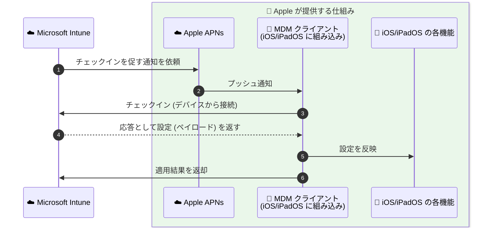
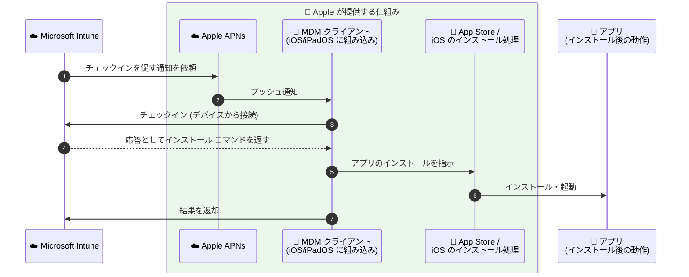
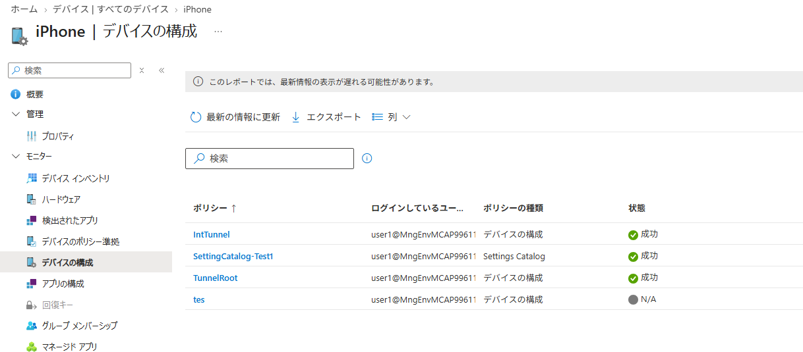
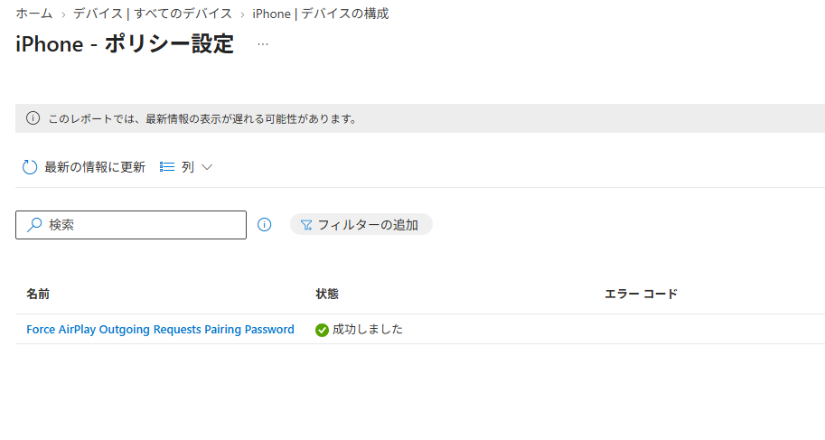
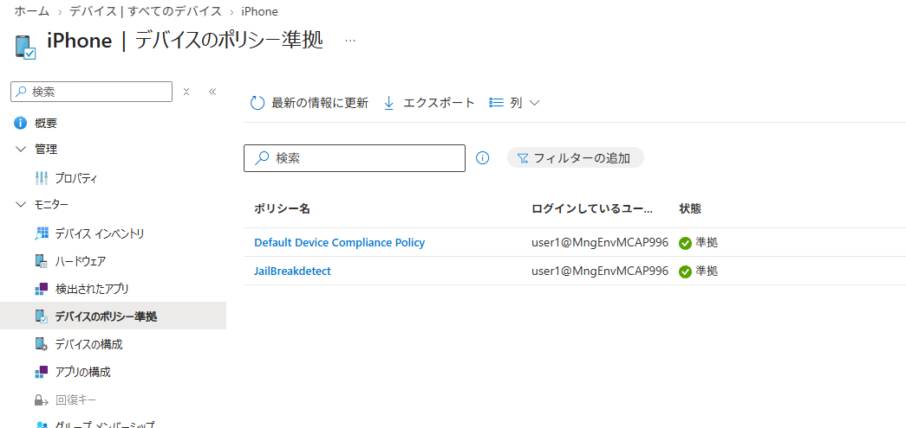
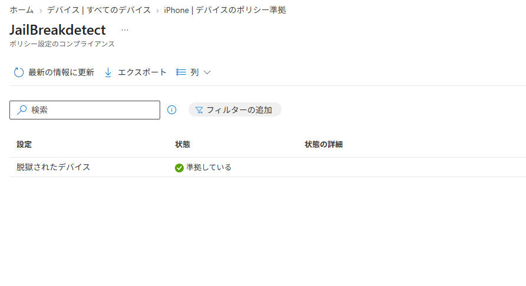
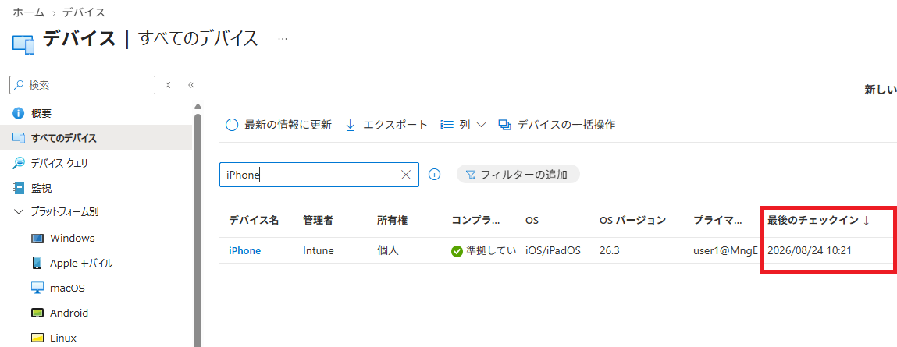
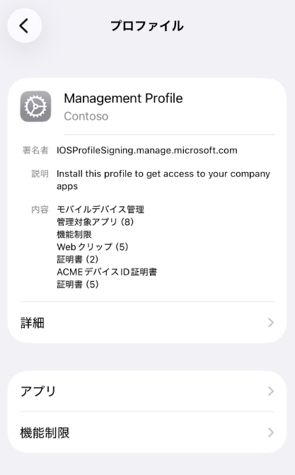
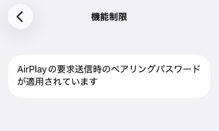

# Intune のトラブル解決が早くなる。知っておきたい iOS/iPadOS との "役割分担" - 基本編

みなさま、こんにちは。Intune サポート チームです。

日々 Intune を活用してデバイス管理を進めていただき、ありがとうございます。今回は、以前ご紹介した「Intune と Windows の役割分担」の iOS/iPadOS 版として、Intune を運用されている皆さまにぜひ知っておいていただきたい「Intune と iOS/iPadOS の役割分担」についてご紹介します。

一見すると地味なテーマに思えるかもしれませんが、この "境界" を理解しておくと、いざ問題が起きたときに「どこを確認すればよいか」がすぐに分かるようになり、原因の特定や解決までの時間を大きく短縮できます。運用のストレスを減らし、より快適に Intune をお使いいただくための第一歩として、ぜひ最後までお読みください。

## はじめに ― なぜ「切り分け」が大切なのか

Intune の様々な機能は、その裏側で Apple が提供する MDM の仕組み (Apple の MDM プロトコルと APNs) と、iOS/iPadOS が持つ機能を利用して動作しています。そのため、何か想定通りに動かない事象が起きたとき、その原因が **Intune 側にあるのか、それとも iOS/iPadOS (Apple) 側にあるのか** をあらかじめ切り分けておくことがとても重要です。

事前に切り分けができていると、次のようなメリットがあります。

- 確認すべきログや設定のポイントを最初から絞り込めるため、調査がスムーズに進む
- ご自身での解決につながるケースも多く、待ち時間なく対処できる
- 万一サポートへお問い合わせいただく場合でも、最初から的確な情報をもとに調査を開始できる

切り分けを進めるにあたって、あわせて確認しておくとよい点が 2 つあります。

1 つは、**サポート契約とサポート範囲**です。ここは Windows と大きく異なる、特にご注意いただきたいポイントです。

Windows の場合は OS そのものもマイクロソフトが提供しているため、事象が Windows 側にあると分かった場合でも、ご契約の内容によっては引き続きマイクロソフトのサポートでお受けできることがあります。

一方 iOS/iPadOS の場合、**OS そのものはもちろん、Apple Business Manager (ABM) / Apple School Manager (ASM)、App Store、APNs (Apple Push Notification service) といった仕組みは、すべて Apple 社が提供するプラットフォームです。そのため、これらに起因する事象については、お客様から Apple 社へお問い合わせいただく必要が生じる場合があります。**

たとえば、次のような事象は Apple 社へのお問い合わせが必要となる場合があります。

- 設定がデバイスに正しく届いているにもかかわらず、iOS/iPadOS 側で期待どおりに動作しない
- ABM / ASM 上でのデバイスの登録状況や、MDM サーバーへの割り当てに関する問題
- App Store や VPP (Apps and Books) でのアプリ・ライセンスの購入に関する問題
- 特定の iOS/iPadOS バージョンへのアップデート後にのみ発生する事象

問題が Apple 側にあると分かってから窓口を探し始めると、その分だけ解決までの時間が延びてしまいます。**Apple 社側のお問い合わせ窓口と、ご利用中のサポート契約の内容を、あらかじめ把握しておく**ことをおすすめします。私もこの仕事を始めるまでは、あまり意識したことはなかったのですが、エンタープライズ環境でモバイル デバイスを利用する場合は、エンタープライズ向けのサポート契約を持っていないと、スムーズに問題が解決出来ない場合があります。これは iOS/iPadOS では見落としがちな準備事項です。

もう 1 つは、ライセンスに関するお問い合わせの窓口です。ライセンスに関するご相談は技術サポートではお受けできませんので、担当の営業担当者やライセンスの購入元へお問い合わせください。

## iOS/iPadOS における MDM 管理の仕組み

まずは、Intune がどのように iOS/iPadOS デバイスを管理しているのか、その全体像を押さえておきましょう。

ここで Windows との一番大きな違いをお伝えしておきます。Windows には Intune Management Extension という Intune 専用のエージェントが存在し、Win32 アプリや PowerShell スクリプトを配布・実行できますが、**iOS/iPadOS にはこれに相当する Intune 専用エージェントは存在しません**。iOS/iPadOS の管理は、**Apple が定めた MDM プロトコルの範囲内** で行われます。

つまり、iOS/iPadOS における Intune の役割は「Apple の MDM プロトコルで定められたコマンドや設定 (ペイロード) をデバイスに届けること」であり、それを受け取って実際に反映・動作させるのは iOS/iPadOS 側、という整理になります。

なお、この Apple の MDM の仕組みそのものについては、Apple 社が「Apple プラットフォーム導入」というガイドで日本語の公開情報を提供しています。デバイスの登録の流れ、構成プロファイルとペイロード、監視対象 (Supervised) といった基本的な考え方が分かりやすくまとまっていますので、あわせてご一読いただくと本記事の内容もより理解しやすくなります。

- デバイス管理プロファイルの概要 (Apple 社の公開情報)
  https://support.apple.com/ja-jp/guide/deployment/depc0aadd3fe/web

- Apple プラットフォーム導入 (Apple 社の公開情報)
  https://support.apple.com/ja-jp/guide/deployment/welcome/web

それでは、Intune と iOS/iPadOS がそれぞれカバーする範囲を、順番に図で見ていきましょう。

### パターン 1：構成プロファイル (設定) の配布

1 つ目は、構成プロファイルなどで設定を配布するパターンです。

Intune はまず Apple の APNs (Apple Push Notification service) を経由して「サーバーにチェックインしてください」という通知だけをデバイスに送ります。**その通知を受け取ったデバイス側の MDM クライアントが Intune へ接続 (チェックイン) し、その応答として設定 (ペイロード) を受け取る**、という流れです。つまり Intune がデバイスへ一方的に設定を押し込んでいるのではなく、**デバイスからの接続がなければ設定は渡せない**、という点がポイントになります。受け取った設定を実際に反映・動作させるのは、iOS/iPadOS に標準で組み込まれている MDM クライアントと各 OS 機能です。

図の緑色の枠で囲まれた部分は、**Apple が提供する仕組みが担当する範囲**です。Intune が直接関与できるのは、①の通知の依頼と、③のチェックインを受けて④で応答を返すところまで、という点をイメージしていただくと分かりやすいかと思います。

つまり、Intune は設定を届ける役割であり、その設定が適用された後にどう振る舞うかは iOS/iPadOS 側が担当している、というのが基本的な考え方です。**「設定が届くまで」が Intune、「届いた設定の動作」が iOS/iPadOS** という線引きになります。

なお、APNs を経由するという仕組み上、**デバイスが APNs と通信できない環境では、設定の配信が遅延したり届かなかったりします**。社内ネットワークでのフィルタリングを行っている場合は、Apple の公開情報を参照のうえ、APNs 向けの通信が許可されているかもあわせてご確認ください。

- Microsoft Intune のネットワーク エンドポイント
  https://learn.microsoft.com/ja-jp/intune/fundamentals/endpoints

- エンタープライズ ネットワークで Apple 製品を使用する (Apple 社の公開情報)
  https://support.apple.com/ja-jp/101555

### パターン 2：アプリの配布

2 つ目は、アプリを配布するパターンです。この場合も基本的な考え方は同じで、Intune が担当するのは **「このアプリをインストールしてください」というコマンドをデバイスへ届けるところまで** です。

実際のアプリのダウンロードとインストールは、App Store (Apple Business Manager で購入したアプリの場合はそのライセンス) と iOS/iPadOS が担当します。そして、インストールされたアプリが起動した後の動作は、そのアプリ自身が担います。

こちらもパターン 1 と同じく、**デバイス側の MDM クライアントからのチェックインに対する応答として、インストール コマンドが渡される**という流れになります。

こちらの図では、緑色の枠の中が Apple が提供する仕組み、その右側にあるアプリはアプリ提供元の担当範囲になります。

アプリがインストールされた後の処理は、それぞれのアプリ自身が担います。そのため、アプリの動作で問題が起きた場合は、アプリ側の情報の確認が必要になります。特にサードパーティー製のアプリをご利用の場合は、問題発生時に備えて **提供元のサポート窓口** をあらかじめ確認しておくことをおすすめします。

なお、本記事では主に構成プロファイル (設定) の配布に焦点を当てて解説します。

### 補足：iOS/iPadOS では「できること」が Apple の仕様で決まっています

Windows では、CSP に用意されていない設定でも PowerShell スクリプトや Win32 アプリを配布することで柔軟に対応できる場合があります。一方 iOS/iPadOS では、**Apple の MDM プロトコルに任意のコードを実行させる仕組みがない** ため、そうした回避策は基本的に利用できません。

そのため iOS/iPadOS では、**「Apple の MDM プロトコルで提供されている機能しか実現できない」** という点が大前提になります。「この設定を Intune から配布できないか」というご要望をいただくことがありますが、そもそも Apple 側にその仕組みが用意されていない場合は、残念ながら Intune からも実現することが難しいです。

一見すると制約に思えるかもしれませんが、切り分けの観点では非常に分かりやすい線引きとも言えます。

なお、Intune の管理センターの画面上に設定項目が見当たらない場合でも、**カスタム プロファイル** を使えば、Apple Configurator などで作成した構成プロファイル (`.mobileconfig` ファイル) をインポートして配布できます。ただしこれも配布できるのは Apple が用意しているペイロードのみで、**Apple がサポートしていない設定を新たに実現できるわけではない**点はご留意ください。

- Microsoft Intune で Apple デバイスにカスタム設定を追加する
  https://learn.microsoft.com/ja-jp/intune/device-configuration/templates/configure-custom-settings-apple

そもそも Apple 側にその仕組みが用意されているのかを確認したい場合は、Apple 社が公開している下記のページが手がかりになります。構成プロファイルで指定できるペイロードが一覧化されており、**ペイロード名と識別子、対応する OS、デバイス チャンネル／ユーザー チャンネルの別、利用可能な登録方法** まで確認できます。

- Apple デバイスのデバイス管理ペイロードを確認する (Apple 社の公開情報)
  https://support.apple.com/ja-jp/guide/deployment/dep5370d089/web

なお、MDM で送信できるコマンドの一覧など、さらに細かな仕様を確認したい場合は、Apple 社の開発者向けドキュメント (英語) もあわせてご参照ください。

- Device Management (Apple 社の開発者向け公開情報 / 英語)
  https://developer.apple.com/documentation/devicemanagement

## 設定が Intune から配布されているかを確認する方法

「設定が思ったように反映されない」というとき、まず確認したいのが **Intune からの設定配布自体が完了しているかどうか** です。ここが確認できると、問題が「配布まで」なのか「配布後の動作」なのかを切り分けられます。確認方法は大きく 2 つあります。

### 1. Intune 管理センターからの確認方法

設定が Intune から配布されているかは、基本的に Intune 管理センターの下記の画面から確認できます。「成功」と表示されている構成プロファイルについては、Intune からの設定の配信自体は完了していると判断できます。

`[デバイス] - [すべてのデバイス] - [<確認対象のデバイス>] - [デバイスの構成]`

対象のプロファイルを選択すると、各設定の配信状況をより細かく確認できます。

`[デバイス] - [すべてのデバイス] - [<確認対象のデバイス>] - [デバイスの構成] - [<確認対象の構成プロファイル>]`

同様に、コンプライアンス ポリシーについても下記の画面から確認できます。

`[デバイス] - [すべてのデバイス] - [<確認対象のデバイス>] - [デバイスのポリシー準拠]`

`[デバイス] - [すべてのデバイス] - [<確認対象のデバイス>] - [デバイスのポリシー準拠] - [<確認対象のコンプライアンス ポリシー>]`

また、構成プロファイルの配信が想定通りに進まない場合には、`[デバイス] - [すべてのデバイス]` から「最後のチェックイン」の時刻を確認し、Intune とデバイスの同期が実際に行われているかを確認することも大切です。同期が行われていなければ、そもそも設定が届いていない可能性があります。

ここで 1 点、iOS/iPadOS ならではの注意点があります。前述のとおり Intune は APNs 経由でチェックインを促すことしかできないため、**デバイスが機内モードであったり、電源が入っていないなどの理由でチェックインが行われなければ、いつまでも配信が完了しません**。想定通りに配信が進まない場合は、まずデバイス側の状態をご確認ください。

#### 補足：`NotNow` ―「失敗」ではなく「今はできない」

iOS/iPadOS のデバイスにおいて、Intune 管理センター上から「成功」の状態が確認出来ない時、よくあるのが `NotNow` と呼ばれる応答がデバイスから返されているパターンです。
Apple の MDM プロトコルでは、デバイスがコマンドを受け取っても実行できない状態のとき、`NotNow` というステータスを返し、後で改めて同期する際にコマンドが再実行されます。公開情報では「デバイスはコマンドを受け取りましたが、現時点ではコマンドに従うことはできません。デバイスは後でサーバーを再度ポーリングします。」と説明されており、**エラーではなく一時的な "保留" の返答** です。Apple 社の公開情報でも、**デバイスの起動後に一度もロックが解除されていない場合など、特定の条件下ではコマンドが実行されず、後で再試行すれば成功する可能性があることを示すために `NotNow` が返される**と説明されています。

これは主に、**デバイスの電源は入っているがロックが解除されていない場合**や、**アプリや OS のアップデートをインストール中**の場合に発生します。このとき Intune 管理センターでは、なかなか「成功」に変わらなかったり、`2016341112 -iOS デバイスは現在ビジー状態です` というエラーが表示されたりします。**iOS プラットフォームの機能であり、Intune に固有の問題ではありません。** 設定を作り直す前に、まずはしばらく待ってみることでエラーが解消されることも多いです。

- Intune でプロファイルを展開するときに iOS デバイスが現在ビジー状態のエラーです
  https://learn.microsoft.com/ja-jp/troubleshoot/mem/intune/device-configuration/2016341112-ios-device-is-currently-busy

- Handling NotNow status responses (Apple 社の公開情報 / 英語)
  https://developer.apple.com/documentation/devicemanagement/handling-notnow-status-responses

### 2. iOS/iPadOS デバイス上での確認方法

Intune 管理センターからだけでなく、デバイス上からも確認できます。Windows のレジストリのように配信された設定の "値" をすべて確認できるわけではありませんが、**どのようなペイロード (機能制限、証明書、Wi-Fi、VPN など) が届いているか** を下記の画面から確認できます。

`[設定] - [一般] - [VPN とデバイス管理] - [Management Profile]`

プロファイルの種類や設定の内容によっても確認箇所は異なる場合があるのですが、一般的な構成プロファイルで配信した設定は下記の画面から確認出来るはずです。

`[設定] - [一般] - [VPN とデバイス管理] - [Management Profile] - [機能制限]`

ここに該当する項目が表示されていれば、Intune からの設定の配信自体は正常に行われていると判断できます。逆に、Intune 管理センター上は「成功」となっているのにデバイス上の管理プロファイルに該当のペイロードが見当たらない場合は、配信のタイミングやデバイスの状態を疑う手がかりになります。

## 「これは Intune？ それとも iOS/iPadOS？」― 事象別の考え方

ここまでの内容を踏まえて、実際にどのような事象がどちら側の調査対象になるのかを整理してみましょう。基本的な考え方はシンプルです。

- **Intune からの設定やコマンドの "配信" に関すること** → Intune の観点から確認
- **設定自体の "挙動" や、配布後の "動作" に関すること** → iOS/iPadOS の観点から確認

以下に具体的な例を挙げます。ご自身で事象を切り分ける際の参考にしてください。

### Intune 側に焦点を当てて確認するとよい事象

- 構成プロファイルの割り当てをフィルターで行っているが、意図したデバイスが配信対象とならず適用外になってしまう
- デバイス上の管理プロファイルには設定が届いているものの、Intune 管理センター上では構成プロファイルの配信状況が確認できない
- デバイスは正常にチェックインしているのに、特定のプロファイルだけが割り当てられていない

### iOS/iPadOS 側に焦点を当てて確認するとよい事象

- Intune 管理センター上ではプロファイルの配信が「成功」と表示され、デバイス上の管理プロファイルにも設定が届いているのに、期待した動作が iOS/iPadOS 側で得られない
- Intune 管理センター上に `2016341112 -iOS デバイスは現在ビジー状態です` のようなエラーが表示され続ける (前述の `NotNow` の補足をご参照ください)
- ソフトウェア更新のポリシーを配信したが、Apple 側の更新プログラムの提供状況により、実際のアップデートが開始されない

なお、冒頭でも触れたとおり、**こちらに分類される事象は Apple 社が提供するプラットフォーム側の領域となるため、Apple 社へのお問い合わせが必要となることがあります。**

ポイントは、**「設定やコマンドがデバイスに届いているか」までが Intune の動作、「届いた設定やコマンドがどう動くか」からが iOS/iPadOS の動作** ということです。この線引きを意識するだけで、確認すべき方向が明確になります。

## おわりに

今回は、Intune と iOS/iPadOS の "境界" という視点から、デバイス管理のトラブルシューティングを進めるうえでの基本的な考え方をご紹介しました。

- Intune は「設定やコマンドを APNs 経由で届ける」役割、iOS/iPadOS は「届いた設定やコマンドを動作させる」役割
- iOS/iPadOS には Intune 専用エージェントが存在せず、実現できることは Apple の MDM プロトコルの範囲内に限られる
- 「設定が届いているか」は Intune 管理センターとデバイス上の管理プロファイルから確認できる
- 事象が「配信まで」なのか「配信後の動作」なのかで、確認すべき方向が変わる
- **Apple 側の領域と判明した事象は Apple 社へのお問い合わせが必要となるため、窓口とサポート契約を事前に把握しておく**

この考え方を身につけていただくと、問題が起きたときに落ち着いて原因を切り分けられるようになり、より快適に Intune をご活用いただけるはずです。ぜひ日々の運用に取り入れてみてください。

次回以降も、皆さまの運用に役立つ情報をお届けしていきます。最後までお読みいただき、ありがとうございました。
