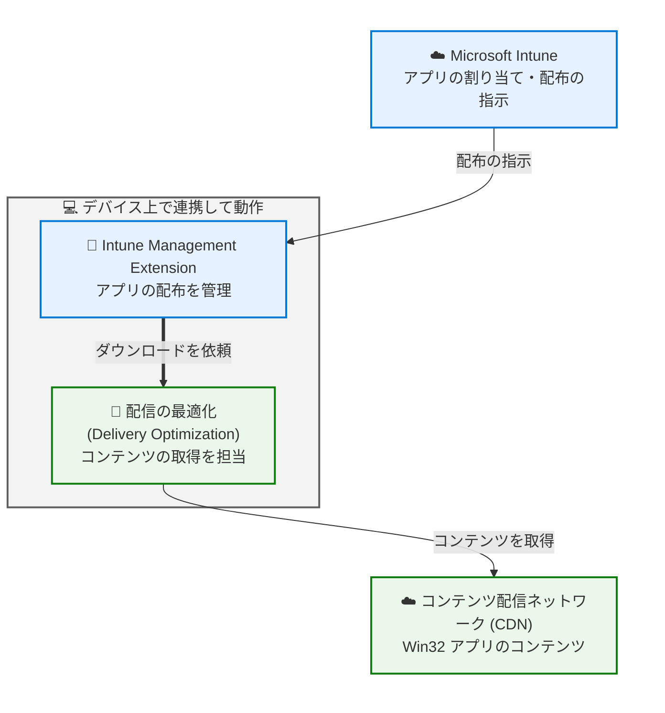
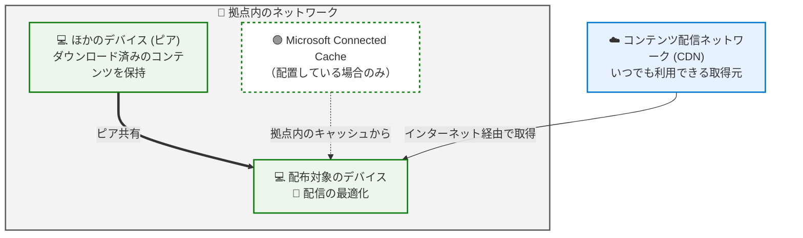
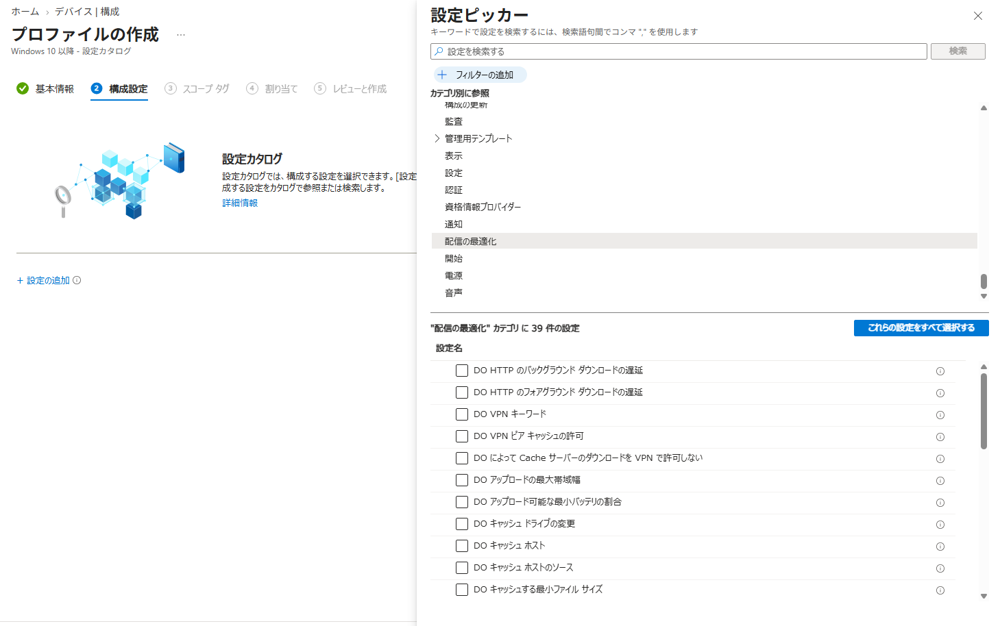

# 回線の逼迫を防ぐために。Intune から Win32 アプリを配布するときのネットワーク負荷を抑えるコツ

みなさま、こんにちは。Intune サポート チームです。

Intune はもともとモバイル デバイスの管理 (MDM) を出発点としたサービスですが、近年ではこれまでオンプレミスの仕組みで管理されてきた Windows デバイスを、Intune へ移行して運用されるお客様がぐんと増えてきました。

そこで一度は考えておきたいのが、**アプリのコンテンツがどこから、どのくらいの量、どのタイミングで流れてくるのか** という点です。オンプレミスの管理製品では、拠点ごとに配布サーバーを置き、そこからクライアントへ配布する構成が一般的でした。一方 Intune は、その名のとおりクラウド サービスです。数百台のデバイスに一斉にアプリを割り当てると、その分のコンテンツがインターネット回線を通ってダウンロードされることになります。

「アプリを割り当てた直後から、拠点の回線が重くなってしまった」「大きなアプリを全社に配布したいが、業務への影響が心配」。こうしたお悩みは、事前にいくつかのポイントを押さえておくだけ軽くすることができます。

そこで今回は、Intune から Win32 アプリを配布する際に、**ネットワークへの負荷を抑えるための考え方と、具体的な設定** をご紹介していきます。

なお、Win32 アプリの配布そのものについては、下記の記事でもご紹介しています。あわせてご覧いただくと、より効果的に運用いただけます。

- 意外と見落としがち？ Intune で Win32 アプリを配布する前に確認しておきたいポイント
  https://jpintune.github.io/blog/intune/20260728_01/

- Intune のトラブル解決が早くなる。知っておきたい "役割分担" - Win32 アプリ編
  https://jpintune.github.io/blog/intune/20260818_01/

## はじめに ― Win32 アプリの配信には「配信の最適化」が使えます

具体的な設定に入る前に、ぜひ知っておいていただきたい、心強いポイントがあります。それは、**Intune から配布する Win32 アプリのコンテンツのダウンロードには、Windows の「配信の最適化 (Delivery Optimization)」が使われている** という点です。

配信の最適化は、Windows Update や Microsoft 365 Apps の配信でも使われている、Windows に標準で備わっている仕組みです。同じ拠点にいるデバイス同士でコンテンツを分け合ったり (ピア共有)、使用する帯域に上限を設けたり、拠点内のキャッシュ サーバーから取得したりと、**ネットワーク負荷を抑えるための機能がひととおり揃っています。**

Intune から Win32 アプリを配布すると、デバイス上の Intune Management Extension (以下、IME) がコンテンツのダウンロードを依頼し、それを受けて配信の最適化が実際の取得を行います。つまり、**Windows Update の配信で培ってきた配信の最適化のノウハウや設定を、そのまま Win32 アプリの配布にも活かせる** ということです。

このことが分かると、打てる手も自然と見えてきます。ネットワーク負荷への対策は、大きく次の 2 つの方向から考えていくことになります。

- **割り当ての設定**: 「いつ」「どのデバイスに」ダウンロードさせるかを調整する
- **配信の最適化の設定**: 「どこから」「どのくらいの帯域で」取得するかを調整する

どちらも Intune 管理センターから設定できますので、順に見ていきましょう。

- Microsoft Intune での Win32 アプリの管理
  https://learn.microsoft.com/ja-jp/intune/app-management/deployment/win32

## 事前準備 ― ネットワーク管理者の方と相談しておく

具体的な設定の前に、最も効果が大きく、そして見落とされがちなのがこのステップです。

率直に申し上げると、Intune や Windows の設定だけでできることには限界があります。回線そのものの帯域や、拠点とインターネットの間にあるプロキシ・ファイアウォールの構成は、Intune からは変えられません。だからこそ、**配布を始める前に、ネットワークを管理されている方と一度会話をしておく** ことが、結果的にいちばんの近道になります。

相談の際は、次のような情報を持っていくと話がスムーズです。

- **配布するアプリのサイズ** 
- **配布対象のデバイス台数** と、その **拠点ごとの内訳**
- **配布したいタイミング** (業務時間内か、夜間か)
- 拠点の **回線の帯域** と、通常時の使用状況
- **プロキシや VPN を経由するか**、経由する場合はその構成

ここで一度、ざっくりとで構いませんので総量を試算してみてください。たとえば 1 GB のアプリを 500 台へ配布する場合、単純計算で約 500 GB のトラフィックが発生します。これが同じ拠点に集中するのか、全国に分散するのかで、必要な対策はまったく変わってきます。

この試算をお持ちいただくと、「その時間帯なら問題ない」「この拠点だけは分けてほしい」といった具体的なアドバイスをネットワーク管理者の方からいただけることも多く、後の設定検討がとても進めやすくなります。

## 割り当ての設定でできる工夫

まずは、アプリの割り当ての設定でできる工夫を見ていきます。

### ① グループを分けて、段階的に割り当てる

いちばんシンプルで、それでいて確実に効くのがこの方法です。

「全ユーザー」「全デバイス」への割り当ては手軽ですが、**その瞬間にすべてのデバイスが一斉にダウンロードを始める** ことになります。まずは配布対象をグループに分け、段階的に広げていく形を検討してみてください。

グループの分け方としては、たとえば次のような切り口があります。

- **拠点・オフィス単位で分ける** … 同じ回線を共有しているデバイスをまとめて把握できるため、ネットワーク負荷の観点ではもっとも効果的です
- **部署・業務単位で分ける** … 業務への影響が少ない部署から順に展開できます
- **パイロット → 本展開の 2 段階に分ける** … まず数十台で検証してから全社展開へ進みます

この方法には、ネットワーク負荷を分散できること以外にも、うれしい効果があります。**万が一アプリのインストールに問題があった場合でも、影響範囲を最小限に抑えられる** という点です。全社に配布した後で問題に気付くのと、パイロット グループの段階で気付けるのとでは、対応の負担がまったく違ってきます。

なお、デバイスのグループ分けには、Microsoft Entra ID の動的グループや、Intune の割り当てフィルターも活用できます。

- グループを追加して Microsoft Intune のユーザーとデバイスを整理する
  https://learn.microsoft.com/ja-jp/intune/fundamentals/tenant-administration/add-groups

- Microsoft Intune でアプリ、ポリシー、プロファイルを割り当てるときにフィルターを使用する
  https://learn.microsoft.com/ja-jp/intune/fundamentals/filters/overview

### ② 割り当ての「可用性」と「インストール期限」を活用する

グループを分けたら、次は **タイミング** です。ここで活躍するのが、割り当て時に設定できる「アプリの可用性」と「インストール期限」です。

この 2 つの設定を理解するうえで大切なのが、**「必須」として割り当てた場合、コンテンツのダウンロードは "可用性" の時刻に始まる** という動作です。

- **可用性 (Availability)** … この時刻に IME がコンテンツのダウンロードを開始し、デバイス上にキャッシュします
- **インストール期限 (Installation deadline)** … この時刻にインストールが実行されます

つまり、可用性を夜間や休日に設定しておくことで、常時起動しているようなデバイスであれば **重いダウンロードは業務時間外に済ませておき、インストールだけを任意のタイミングで行う**、という運用ができるわけです。「業務時間中に回線が重くなる」というお悩みには、まさにこの設定がぴったりです。

さらに、①のグループ分けと組み合わせるとより効果的です。グループごとに可用性の日時を 1 日ずつ、あるいは数時間ずつずらしておけば、ダウンロードの山が自然に平準化され、特定の時間帯にトラフィックが集中することを避けられます。

一方、「利用可能」として割り当てた場合は動作が少し異なります。この場合の可用性の時刻は **ポータル サイトにアプリが表示され始めるタイミング** を指し、コンテンツのダウンロードはユーザーがポータル サイトからインストールを要求した時点で行われます。ユーザーの操作に依存する分、トラフィックは自然に分散されやすいという特徴があります。

設定は、アプリの割り当てを追加する際に表示される編集画面から行えます。

`[アプリ] - [すべてのアプリ] - [<対象のアプリ>] - [プロパティ] - [割り当て]`

なお、指定した時刻にダウンロードが始まるのは、当然ながら **デバイスが起動していて、ネットワークに接続されている場合** です。夜間に設定される場合は、対象のデバイスが電源オフやスリープになっていないか、あわせてご確認ください。

- Microsoft Intune での Win32 アプリの管理 (Win32 アプリの可用性と通知の設定)
  https://learn.microsoft.com/ja-jp/intune/app-management/deployment/win32

### ③ 割り当ての「配信の最適化の優先度」を確認する

もう一つ、割り当ての画面で見ておきたいのが `[アプリの設定]` にある **配信の最適化の優先度** です。

ここでは、コンテンツをバックグラウンドとフォアグラウンドのどちらのモードでダウンロードするかを、割り当てごとに選択できます。

- **バックグラウンドでダウンロード** (既定) … 急いでいない配信向けのモードです
- **フォアグラウンドでダウンロード** … ユーザーが待っている前提のモードです

配信の最適化では、**帯域の上限や、ピア・キャッシュ サーバーを待つ時間といった設定が、バックグラウンド用とフォアグラウンド用にそれぞれ分かれて用意されています。** ここでどちらのモードを選ぶかによって、そのダウンロードにどちらの設定が適用されるかが決まる、というのがこの項目の役割です。

急いでインストールする必要がない必須アプリであれば、バックグラウンドを選んでおくことで、後述の帯域の設定を業務通信に配慮した値にしておけます。逆に、ユーザーがポータル サイトから要求してその場で待っているようなアプリでは、フォアグラウンドのほうが体感は良くなります。**「ユーザーが待っているか、待っていないか」** を基準に選んでいただくと、迷わず決められます。

## 配信の最適化の設定でできる工夫

ここからが、冒頭でご紹介した配信の最適化の出番です。**「どこから取得するか」「どのくらいの帯域を使うか」は、この機能の設定で細かく調整でき、しかもその設定は Intune からそのまま配布できます。**

配信の最適化は、コンテンツを次のような複数のソースから並行して取得できるように作られています。

うれしいことに、**この機能は既定で有効になっています。** Windows の既定のダウンロード モードは「同一 NAT 配下でのピア共有」となっており、同じ拠点にいるデバイス同士でコンテンツを分け合う動作が、特に設定をしなくても働くようになっています。

とはいえ、環境によっては既定のままでは十分に効果が出ないこともあります。ここからは、Intune から調整できる代表的なポイントをご紹介します。

設定は、Intune 管理センターの **設定カタログ** から構成できます。

`[デバイス] - [デバイスの管理] - [構成] - [作成] - [新しいポリシー]` - プラットフォーム: `Windows 10 以降` - プロファイルの種類: `設定カタログ`

ポリシーの `[構成設定]` で `[設定の追加]` を選び、`配信の最適化` の配下を確認すると、構成できる設定の一覧が表示されます。各設定の情報アイコン ⓘ からは説明を確認でき、`[詳細情報]` のリンクからその設定の公開情報を直接開けるのも便利なところです。

なお、`[テンプレート]` にも `[配信の最適化]` が用意されていますが、こちらも設定カタログと同じ設定形式へ置き換わっています。これから新しく作成される場合は、ほかの設定とまとめて管理しやすい設定カタログをご利用いただくのがおすすめです。

- Microsoft Intune で設定カタログを使用してポリシーを作成する
  https://learn.microsoft.com/ja-jp/intune/device-configuration/settings-catalog

- Microsoft Intune での Windows 配信の最適化設定
  https://learn.microsoft.com/ja-jp/intune/device-configuration/templates/configure-delivery-optimization-windows

### 調整できる主なポイント

配信の最適化には多くの設定がありますが、ネットワーク負荷という観点でよく検討されるのは、次のようなものです (括弧内は CSP 名)。

- **ピア共有の範囲を広げる / 狭める**
  - ダウンロード モード (DODownloadMode)
  - グループ ID とそのソース (DOGroupId / DOGroupIdSource)
  - ピアの選択を制限する条件 (DORestrictPeerSelectionBy)

- **使用する帯域そのものを抑える**
  - 最大ダウンロード帯域幅の絶対値 (DOMaxBackgroundDownloadBandwidth / DOMaxForegroundDownloadBandwidth) と割合 (DOPercentageMaxBackgroundBandwidth / DOPercentageMaxForegroundBandwidth)
  - 帯域幅を制限する時間帯 (DOSetHoursToLimitBackgroundDownloadBandwidth / DOSetHoursToLimitForegroundDownloadBandwidth)

- **ピアから取得できる機会を増やす**
  - キャッシュの最大有効期間 (DOMaxCacheAge) ・ 最大サイズ (DOMaxCacheSize / DOAbsoluteMaxCacheSize)
  - ピア キャッシュの最小ファイル サイズ (DOMinFileSizeToCache)

- **ピアやキャッシュ サーバーを探す時間を確保する**
  - HTTP からのダウンロードの遅延 (DODelayBackgroundDownloadFromHttp / DODelayForegroundDownloadFromHttp)
  - キャッシュ サーバーへのフォールバックの遅延 (DODelayCacheServerFallbackBackground / DODelayCacheServerFallbackForeground)

- **拠点内のキャッシュ サーバーを使う**
  - キャッシュ サーバーのホスト名 (DOCacheHost)
  - そのソース (DOCacheHostSource)

このうち **帯域に関する設定と、ピア・キャッシュ サーバーを待つ時間の設定は、バックグラウンド用とフォアグラウンド用がそれぞれ別の設定として用意されています。** 設定の一覧で `バックグラウンド` `フォアグラウンド` という言葉が並んでいるのはこのためです。先ほどの割り当ての「配信の最適化の優先度」とセットで、**どちらのモードで配信するアプリなのかを踏まえて、必要な側 (あるいは両方) を構成する** ようにしてください。

ひとつ例を挙げると、先ほどの既定のダウンロード モード (同一 NAT 配下でのピア共有) では、**同じ拠点であっても、インターネットへの出口 (パブリック IP アドレス) が分かれている環境では、デバイス同士がピアとして認識されない** ことがあります。このようなケースでは、グループ ID を使ったダウンロード モードが選択肢になります。

どの設定をどう組み合わせるとよいかは、拠点のネットワーク構成やデバイスの台数によって変わってきます。Windows の公開情報には、**ネットワーク トポロジーや組織の規模ごとの考え方と、推奨値の一覧** がまとめられていますので、具体的な値を検討される際は、まずはこちらをご覧いただくのが近道です。ネットワーク管理者の方と相談される際の材料としてもご活用いただけます。

- Windows の配信の最適化を構成する (設定の考え方と推奨値)
  https://learn.microsoft.com/ja-jp/windows/deployment/do/delivery-optimization-configure
  
- 配信の最適化リファレンス (各設定の詳細と既定値)
  https://learn.microsoft.com/ja-jp/windows/deployment/do/waas-delivery-optimization-reference

なお、**配信の最適化そのものの動作 (ピアとして選ばれる条件や、帯域制御の実際の挙動など) は Windows OS の機能によるもの** です。そのため、配信の最適化自体の動作を掘り下げる場合は、Windows の観点での調査が必要となりますので、ご注意ください。

### 拠点内にキャッシュを置く ― Microsoft Connected Cache

ピア共有だけでは足りない、あるいは「もっと確実に拠点内で配信を完結させたい」という場合の選択肢が、**Microsoft Connected Cache** です。拠点内に置いたキャッシュ ノードが一度取得したコンテンツを保持し、2 台目以降のデバイスへは拠点内から配信する、という仕組みです。ピア共有との併用もできます。

Intune で管理しているデバイスから利用する場合は、配信の最適化の **キャッシュ サーバーのホスト名 (DOCacheHost)** の設定でキャッシュ ノードを指定します。この設定も、先ほどの設定カタログのポリシーから配布できます。キャッシュ ノードが利用できないときは CDN へフォールバックするため、「キャッシュ ノードが止まったらアプリが配布できなくなる」という心配は不要です。

小規模な拠点であれば Windows 11 のクライアント デバイスへ、大規模な拠点であればサーバーへと、規模に応じて展開できます。すでに Configuration Manager をご利用の場合は、既存の配布ポイント上で有効化する形も選べます。

- Microsoft Connected Cache for Enterprise and Education の概要
  https://learn.microsoft.com/ja-jp/windows/deployment/do/mcc-ent-edu-overview
  
- Configuration Manager での Microsoft Connected Cache
  https://learn.microsoft.com/ja-jp/intune/configmgr/core/plan-design/hierarchy/microsoft-connected-cache

## おわりに

今回は、Intune から Win32 アプリを配布する際のネットワーク負荷を抑える方法について、割り当ての設定と配信の最適化の両面からご紹介しました。最後に、要点をまとめておきます。

- Win32 アプリのコンテンツのダウンロードには **Windows の配信の最適化** が使われており、その機能をそのまま活用できる
- **割り当ての設定** では、グループを分けて段階的に割り当て、**可用性の時刻をずらす** ことでダウンロードのタイミングを分散できる
- **配信の最適化の設定** では、**ダウンロード モード・帯域幅・キャッシュ** によって「どこから」「どのくらいの帯域で」取得するかを制御できる (帯域の上限は既定では設定されていないため、抑えたい場合は明示的な構成が必要)
- 拠点内での配信を確実にしたい場合は、**Microsoft Connected Cache** も選択肢になる
- そして何より、**配布を始める前にネットワーク管理者の方と相談しておく** こと

大きなアプリの一斉配布は、ちょっと身構えてしまう作業かもしれません。ですが、「いつ」「どのデバイスが」「どこから」コンテンツを取得するのかを整理して考えれば、打てる手は意外とたくさんあります。ぜひ、次の配布計画に取り入れてみてください。

次回以降も、みなさまの運用に役立つ情報をお届けしていきます。最後までお読みいただき、ありがとうございました。
