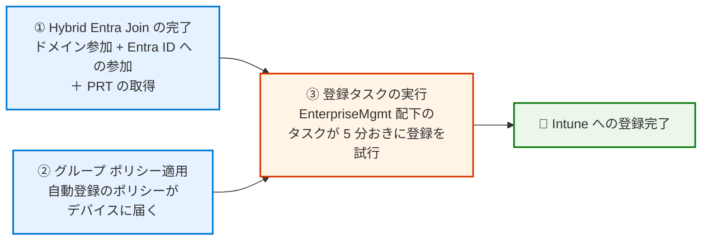

# Hybrid Entra Join 環境で Intune 登録が行われないときの確認ポイント

みなさま、こんにちは。Intune サポート チームです。

オンプレミスの Active Directory で長く運用してきた Windows デバイスを、Intune でも管理していきたい。そんなときに多くのお客様が選ばれるのが、**Hybrid Entra Join (Microsoft Entra ハイブリッド参加)** と **グループ ポリシーによる自動登録** の組み合わせです。既存のドメイン参加の仕組みを活かしたまま、ポリシーを 1 つ配布するだけで Intune への登録が進んでいく。とても便利な仕組みです。

一方で、いざ展開してみると「グループ ポリシーは配ったはずなのに、いつまで経っても Intune にデバイスが出てこない…」という状況に遭遇することがあります。しかもエラー ダイアログが出るわけでもなく、ただ静かに何も起きない。これが、この構成のトラブルシューティングを少し難しくしているところです。

実はこの事象、**どこを見ればよいかを押さえておけば、多くのケースでご自身で原因までたどり着ける** ものです。今回はその「見るべき場所」と「確認する順番」を整理してご紹介します。

なお、内容が多岐にわたるため、本記事は前編・後編の 2 回に分けてお届けします。

- **前編 (本記事)** … 登録が動く仕組みと、**確認すべき 3 つのステップ**
- **後編** … ステップ ③ で得られた **エラー コード別のトラブルシューティング**

後編は下記からご覧いただけます。

- Hybrid Entra Join 環境で Intune 登録が行われないとき ― エラー コード別のトラブルシューティング
  https://jpintune.github.io/blog/intune/20261001_02/

## まずは全体像 ― 「2 つの条件」がそろって登録が動く

トラブルシューティングに入る前に、この構成でデバイスが Intune に登録されるまでの流れを押さえておきましょう。ポイントは、**登録処理が動くには 2 つの条件がそろう必要がある** ということです。



ちなみに **① と ② に順番の決まりはありません**。「先に Hybrid Entra Join を済ませてからポリシーを配る」でも、「先にポリシーを配っておいて、あとからドメイン参加させる」でも構いません。

というのも、② のポリシーが適用された時点で登録タスクが作成され、そのタスクが **5 分おきに登録を試行し続ける** ためです。仮に ② が先でも、タスクはリトライを続けながら ① の完了を待ち、条件がそろったところで登録が成功します。

裏を返すと、**「どちらか一方でも欠けていると、③ は成功しない」** ということでもあります。ですので、うまくいかないときは「処理がどこまで進んだか」ではなく **「① と ②、欠けているのはどちらか」** を探しにいくのが、この構成の切り分けのコツです。

ありがちなのが、「Intune に登録されない」という症状から、いきなり Intune 管理センターの設定を疑って調べ始めてしまうケースです。しかし実際には、① や ② が欠けたままになっていることが少なくありません。

なお、**確認する順番としては ① からをおすすめします。** ① が欠けている場合、それは Intune ではなく Microsoft Entra ID 観点から確認を進める必要がある事象であり、先に見極めておくと調査の方向性そのものが変わってくるためです。

本記事は、この ① ② ③ をそのままステップ ①〜③ として順に確認していき、**最後にステップ ③ の結果に応じた掘り下げ (症状別のトラブルシューティング) を行う** という構成でご紹介します。

それでは、順番に見ていきましょう。

## ステップ ①：Hybrid Entra Join と MDM 構成の状態を確認する

最初に確認したいのがここです。自動登録は Hybrid Entra Join が完了していることを前提に動作するため、ここが満たされていなければ、ほかをいくら整えても登録は成功しません。しかも、この 1 つのコマンドだけで **「テナントの MDM 構成がデバイスに届いているか」まで一緒に確認できます。**

ここで確認する内容は、**いずれも Microsoft Entra ID の観点から調査が必要な領域** です。裏を返すと、このステップでつまずいている場合は Intune 管理センターを調べても原因は見つかりません。最初に確認する価値が高いのは、そのためです。

確認には `dsregcmd /status` コマンドを使用します。

```
dsregcmd /status
```

### ⚠️ 実行するコンテキストにご注意ください

ここで 1 つ、とても重要な注意点があります。

`dsregcmd /status` の出力のうち、**SSO State セクション (PRT の情報) は「コマンドを実行したユーザー」の状態を示します**。そのため、トラブルシューティングの癖で「管理者として実行」でコマンド プロンプトを開いてしまうと、実際にサインインして業務をしているユーザーではなく、その管理者アカウントの状態が表示されてしまいます。

**必ず、事象が発生しているユーザーでサインインした状態で、通常のコマンド プロンプト (管理者昇格なし) から実行してください。** ここを取り違えると誤った判断をしてしまい、切り分けが振り出しに戻ってしまいます。

### 見るべきは 4 つのフィールド

出力は情報量が多いのですが、まず確認いただきたいのは次の 4 つです。いずれも同じ `dsregcmd /status` の出力内にあります。

| セクション | フィールド | 期待値 | 意味 |
|---|---|---|---|
| Device State | `DomainJoined` | `YES` | オンプレミス AD にドメイン参加できている |
| Device State | `AzureAdJoined` | `YES` | Microsoft Entra ID にも参加できている |
| SSO State | `AzureAdPrt` | `YES` | サインイン中のユーザーが PRT を取得できている |
| Tenant Details | `MdmUrl` | URL が入っている | テナントの MDM 構成がこのデバイスまで届いている |

順に見ていきましょう。

#### `DomainJoined` / `AzureAdJoined` ― そもそも参加できているか

`DomainJoined` と `AzureAdJoined` が **両方とも `YES`** になっていて、はじめて「Hybrid Entra Join が完了している」と言えます。どちらか一方でも `NO` であれば、この時点で自動登録の条件は満たされていません。

#### `AzureAdPrt` ― 意外と見落とされやすい落とし穴

PRT (Primary Refresh Token) は、ユーザーがそのデバイス上で Microsoft Entra ID に対して認証済みであることを示すトークンです。**自動登録はこの PRT を使ってサイレントに (ユーザーに何も聞かずに) 処理を進める** ため、`AzureAdPrt: NO` の状態では登録は成功しません。

「参加は済んでいるのに登録されない」というケースでは、ここが `NO` になっていることがよくあります。

> **💡 `DomainJoined` / `AzureAdJoined` / `AzureAdPrt` に問題があった場合**
> これらは Intune ではなく **Microsoft Entra ID 側で対処すべき事象** です。デバイス側で Hybrid Entra Join をやり直すことで解決するケースも多く、その具体的な手順は Azure & Identity サポート チームのブログで公開されています。
>
> - Microsoft Entra ハイブリッド参加デバイスを再構成する (Japan Azure Identity Support Blog)
>   https://jpazureid.github.io/blog/azure-active-directory/haadj-re-registration/
>
> なお、この手順は **Microsoft Entra ID でデバイスを認証する構成 (Sync Join / マネージド)** が対象です。AD FS のクレーム ルールを使用したフェデレーション構成では利用できません。

#### `MdmUrl` ― テナントの設定がデバイスに届いているか

3 つめまでとは少し性質が異なるのがこの `MdmUrl` です。出力の **Tenant Details** セクションに含まれています。

```
+----------------------------------------------------------------------+
| Tenant Details                                                       |
+----------------------------------------------------------------------+

                TenantName : Contoso
                  TenantId : aaaabbbb-0000-cccc-1111-dddd2222eeee
               AuthCodeUrl : https://login.microsoftonline.com/aaaabbbb-0000-cccc-1111-dddd2222eeee/oauth2/authorize
            AccessTokenUrl : https://login.microsoftonline.com/aaaabbbb-0000-cccc-1111-dddd2222eeee/oauth2/token
                    MdmUrl : https://enrollment.manage.microsoft.com/EnrollmentServer/Discovery.svc
                 MdmTouUrl : https://portal.manage.microsoft.com/TermsOfUse.aspx
          MdmComplianceUrl : https://portal.manage.microsoft.com/?portalAction=Compliance
```

`MdmUrl` には、デバイスが Microsoft Entra ID から受け取った **「どの MDM サービスに登録すればよいか」** という情報が入ります。

つまりこの値は、**Microsoft Entra 管理センターで設定した MDM の構成が、実際にこのデバイスまで届いているかを、デバイス側から検証できる指標** になっています。管理センターの設定画面とデバイス側の実態を突き合わせられるため、ここが空欄かどうかが分かるだけで切り分けが一気に進みます。

**`MdmUrl` が空欄・表示されない場合**、MDM が構成されていないか、**サインイン中のユーザーが MDM 登録のスコープ外** であることを示します。空欄だった場合は Microsoft Entra 管理センター上から次の 3 項目をご確認ください。

`[Entra ID] - [モビリティ] - [Microsoft Intune]`

| # | 確認項目 | 期待値・注意点 |
|---|---|---|
| 1 | MDM ユーザー スコープ | `すべて`、または対象ユーザーが含まれるグループ。**空欄の原因として最も多いのがここ** |
| 2 | Windows 情報保護 (WIP) ユーザー スコープ | `なし` を推奨。MAM が優先されると MDM 自動登録が行われません |
| 3 | MDM の探索 URL | 既定値 `https://enrollment.manage.microsoft.com/enrollmentserver/discovery.svc`。この値がそのまま `MdmUrl` に現れます |

管理センター上は正しく設定されているように見えるのに `MdmUrl` が空欄、というときは、**対象ユーザーが実際にスコープに含まれているか** (グループ指定の場合はそのグループのメンバーになっているか) をあらためてご確認ください。設定画面とデバイス側の実態を突き合わせられるのが、この `MdmUrl` チェックの価値です。

> **💡 `MdmUrl` があっても「登録済み」という意味ではありません**
> `MdmUrl` はあくまで「テナントに自動登録の構成がある」ことを示すもので、**そのデバイス自体が MDM で管理されているかどうかを表すものではありません。** 値が入っていても未登録ということは普通にありますので、登録の成否はステップ ③ のイベント ログでご確認ください。

なお、Tenant Details セクションは、デバイスが Microsoft Entra 参加済みまたは Microsoft Entra ハイブリッド参加済みの場合に表示されます。セクション自体が見当たらない場合は、そもそも参加が完了していない可能性がありますので、`DomainJoined` / `AzureAdJoined` をあらためてご確認ください。

### 結果ごとの次のアクション

| 状態 | 判断 | 次にすること |
|---|---|---|
| 4 つとも期待値どおり | ステップ ① は問題なし | ステップ ② へ進む |
| `AzureAdJoined: NO` | Hybrid Entra Join 自体が未完了 | Entra ID 観点で調査 |
| `AzureAdPrt: NO` | PRT を取得できていない | Entra ID 観点で調査 |
| `MdmUrl` が空欄 | テナントの MDM 構成がデバイスに届いていない | Entra ID 観点で調査 (モビリティ設定の **MDM ユーザー スコープ** を最優先で確認) |

**4 つのいずれかが期待値どおりでない場合、いずれも Microsoft Entra ID 観点で調査を進める必要がある事象です。** ただし、その理由は次の 2 つに分かれます。

- **`DomainJoined` / `AzureAdJoined` / `AzureAdPrt`** — Hybrid Entra Join (デバイス登録) 自体が正常に完了していない
- **`MdmUrl`** — Join は完了しているが、**Microsoft Entra ID 側のモビリティ設定** (MDM ユーザー スコープなど) がデバイスに反映されていない

理由は異なりますが、**どちらも Microsoft Entra ID の観点から調査を行う必要があります。** この切り分けができているだけで調査の方向性が大きく変わりますし、サポートへお問い合わせいただく際にも適切な窓口へスムーズにおつなぎできます。

なお、ドメイン参加済みで Hybrid Entra Join が未完了の場合は、`dsregcmd /status` の出力に **Pre-Join Diagnostics** というセクションが表示され、SCP (Service Connection Point) の構成やデバイス登録サービスへの疎通確認の結果を確認できます。各フィールドの詳しい読み方とあわせて、下記もご参照ください。

- デバイスのトラブルシューティング (dsregcmd コマンドの使用)
  https://learn.microsoft.com/ja-jp/entra/identity/devices/troubleshoot-device-dsregcmd

- Microsoft Entra ハイブリッド参加済みデバイスのトラブルシューティング
  https://learn.microsoft.com/ja-jp/entra/identity/devices/troubleshoot-hybrid-join-windows-current

## ステップ ②：グループ ポリシーがデバイスに届いているかを確認する

ステップ ① が問題なければ、もう一方の条件である「自動登録のポリシーがデバイスに届いているか」を確認します。

### ポリシーの設定内容を確認する

まず、自動登録のポリシーそのものです。設定場所は次のとおりです。

```
[コンピューターの構成] - [ポリシー] - [管理用テンプレート] - [Windows コンポーネント] - [MDM]
  - [既定の Azure AD 資格情報を使用して MDM の自動登録を有効にする] : "有効" かつ "ユーザー資格情報"
```

このポリシーがグループ ポリシー エディターに見当たらない場合は、ドメイン コントローラーの Central Store に配置されている ADMX ファイル (MDM.admx) が古い可能性があります。最新の ADMX をご配置ください。

#### 「資格情報の種類」の選択にご注意ください

このポリシーを有効にすると、**[使用する資格情報の種類を選択する]** という設定項目が現れ、`ユーザー資格情報` と `デバイスの資格情報` を選択できます。ここは、**通常の Hybrid Entra Join 環境では `ユーザー資格情報` を選択します。**

`デバイスの資格情報` は一見よさそうに見えるのですが、Intune のサブスクリプションがユーザー中心の仕組みであるため、**共同管理 (Co-management) または Azure Virtual Desktop のマルチセッション ホスト プールのシナリオでのみサポートされる** 選択肢です。該当しない環境で選択すると、登録が想定どおりに進まない原因になります。

「よかれと思って `デバイスの資格情報` を選んでいた」というのは実際にあるパターンですので、うまくいかない場合はこの設定もあわせてご確認ください。

### ポリシーが実際にデバイスへ適用されているかを確認する

設定内容が正しくても、そのポリシーが対象デバイスに届いていなければ意味がありません。デバイス側で適用状況を確認します。

おすすめは **`rsop.msc` (ポリシーの結果セット)** です。管理者権限で実行すると、グループ ポリシー エディターと同じツリー構造で **「最終的にこのデバイスに適用された設定」** を確認できます。

```
rsop.msc
```

起動したら、次の場所を開いてください。

```
[コンピューターの構成] - [管理用テンプレート] - [Windows コンポーネント] - [MDM]
```

ここに **[既定の Azure AD 資格情報を使用して MDM の自動登録を有効にする]** が `有効` として表示されていれば、ポリシーは確かにデバイスへ届いています。`rsop.msc` の利点は、**設定が適用されているかどうかに加えて「どの値で適用されたか」まで一目で分かる** ことです。前述の「資格情報の種類」が意図したとおりに設定されているかも、ここで確認できます。

`rsop.msc` に該当の設定が出てこない場合は、Intune 以前に **グループ ポリシーの配布そのもの** に問題があります。リンク先の OU、セキュリティ フィルター、対象デバイスがフィルター用グループに含まれているか、といった点をご確認ください。「Intune の問題だと思っていたら、実は GPO が当たっていなかった」というのは、実際によくあるパターンです。

ポリシーの適用を急ぎたい場合は、次のコマンドで更新を試みます。

```
gpupdate /force
```

### 切り分けのコツ ― ローカル グループ ポリシーで試してみる

「GPO は配布しているはずなのに、どうも届いているか自信がない」というときに有効なのが、**対象デバイス上でローカル グループ ポリシーとして同じ設定を入れてしまう** という方法です。

ローカル グループ ポリシー エディター (`gpedit.msc`) を管理者権限で起動し、ドメインの GPO と同じ場所に同じ設定を行います。

```
gpedit.msc
  [コンピューターの構成] - [管理用テンプレート] - [Windows コンポーネント] - [MDM]
    - [既定の Azure AD 資格情報を使用して MDM の自動登録を有効にする] : "有効" かつ "ユーザー資格情報"
```

こうすると、**ドメインの GPO 配布経路を完全に迂回して、自動登録そのものを試せます。** 結果の解釈はシンプルです。

| ローカル GPO で試した結果 | 判断 | 次にすること |
|---|---|---|
| **登録が成功した** | 自動登録の仕組み自体は正常。**問題はドメイン GPO の配布経路** | OU のリンク、セキュリティ フィルター、GPO の適用範囲を見直す |
| **やはり登録されない** | GPO の配布は原因ではない | ステップ ③ 以降 (タスク・イベント ログ・レジストリ) へ進む |

ステップ ② と ③ のどちらに原因があるのかを一手で切り分けられるため、調査が長引きそうなときほど効果的です。また、Intune 登録を急いで行う必要があるデバイスが存在する場合には、一旦ローカル グループ ポリシーで登録を進めてしまうというのも一つの手法です。

- グループ ポリシーを使用して Windows デバイスを自動的に登録する
  https://learn.microsoft.com/ja-jp/windows/client-management/enroll-a-windows-10-device-automatically-using-group-policy

## ステップ ③：自動登録タスクの状態を確認する

グループ ポリシーが適用されると、デバイス上に **自動登録用のタスクが作成** され、そのタスクが実際の登録処理を実行します。ここでは「タスクが作られているか」「動いているか」「結果はどうだったか」を確認していきます。ステップ ① と ② の結果が実際にどう出たかが、ここに現れます。

### タスク スケジューラーで確認する

管理者権限でタスク スケジューラーを起動し、次の場所をご確認ください。

```
[タスク スケジューラ ライブラリ] - [Microsoft] - [Windows] - [EnterpriseMgmt]
```

ここに **「Schedule created by enrollment client for automatically enrolling in MDM from AAD」** という名前のタスクがあれば、グループ ポリシーは正しく処理されています。このタスクが **5 分おきに** 登録を試行します。

タスクの **`前回の実行結果`** 列もあわせてご確認ください。ここには前回の実行時に返されたコードが表示され、**後編での切り分けで重要な手がかり** になります。

ここでの分岐は次のとおりです。

- **タスクが存在しない** → グループ ポリシーが適用されていない可能性のほか、**登録の残骸によってタスクの作成自体がスキップされている** 場合もあります。ステップ ② (`rsop.msc` での確認) とあわせて、後編の「症状 ②：レジストリの残骸」もご確認ください
- **タスクは存在するが実行された形跡がない** → 後編の「症状 ②：レジストリの残骸」を確認
- **タスクは実行されているが失敗している** → 次のイベント ログでエラー コードを確認

### イベント ログで登録の成否を確認する

自動登録の結果は、次のイベント ログに記録されます。

```
[アプリケーションとサービス ログ] - [Microsoft] - [Windows]
  - [DeviceManagement-Enterprise-Diagnostics-Provider] - [Enrollment]
```

> **💡 ビルドによっては `[Admin]` の下にあります**
> このプロバイダーのログは、**2025 年初頭の更新プログラムを境に `Admin` から `Enrollment` / `Sync` / `Admin` の 3 つに分割** されました。それ以前のビルドでは、以降でご紹介するイベントは `[Admin]` に記録されます。**`Enrollment` が見当たらない場合は `Admin` を、`Admin` に何もない場合は `Enrollment` を** ご確認ください。

ここで確認するイベント ID は 2 つです。

| イベント ID | メッセージ | 意味 |
|---|---|---|
| 75 | `Auto MDM Enroll: Device Credential (0x0), Succeeded` | 自動登録に成功 |
| 76 | `Auto MDM Enroll: Device Credential (0x0), Failed (Unknown Win32 Error code: 0x____)` | 自動登録に失敗。**末尾のカッコ内のエラー コードが原因特定の最大の手がかり** |

> **💡 `Device Credential (0x0)` と出ていても異常ではありません**
> このメッセージは **`ユーザー資格情報` を使った場合でも、常に `Device Credential` という表記で記録されます。** カッコ内の値が「デバイスの資格情報を使ったかどうか」を表しており、次のように読み分けます。
>
> - **`(0x0)`** … `ユーザー資格情報` を使用 (通常の Hybrid Entra Join 環境ではこちら)
> - **`(0x1)`** … `デバイスの資格情報` を使用
>
> つまり `ユーザー資格情報` で正しく構成できている場合、**表示されるのは `Device Credential (0x0)`** です。「デバイスの資格情報になってしまっているのでは」と誤解されやすいポイントですので、ご注意ください。

イベント ID 76 が記録されていれば、**そのエラー コードから原因を絞り込めます。**

また、**イベント ID 75 も 76 もまったく記録されていない** というケースもあります。これは「登録に失敗した」のではなく **「登録処理がそもそも起動していない」** ことを意味します。

いずれの場合も、ここから先は **エラー コードごとに確認すべき場所が変わります。** その内容は長くなりますので、後編としてあらためてご紹介します。

- Hybrid Entra Join 環境で Intune 登録が行われないとき ― エラー コード別のトラブルシューティング
  https://jpintune.github.io/blog/intune/20261001_02/

## おわりに

今回は、Hybrid Entra Join 環境で Intune 登録が行われないときに **「どこを、どの順番で確認するか」** をご紹介しました。あらためて要点を整理します。

- 自動登録は **「Hybrid Entra Join」と「グループ ポリシーの適用」の 2 つがそろって動く**。**この 2 つに順番の決まりはなく**、欠けているのがどちらかを探すのが切り分けのコツ
- ステップ ① の `dsregcmd /status` では **4 つのフィールド** (`DomainJoined` / `AzureAdJoined` / `AzureAdPrt` / `MdmUrl`) を確認する。**事象が発生しているユーザーのコンテキストで実行**すること
  - **4 つのいずれかが期待値どおりでなければ、いずれも Microsoft Entra ID 観点での調査が必要**。Intune 管理センターを調べても原因は見つからない
  - `AzureAdPrt: NO` → Hybrid Entra Join (デバイス登録) 自体の問題
  - `MdmUrl` が空欄 → Entra ID のモビリティ設定、特に **MDM ユーザー スコープの設定漏れ**が濃厚
- グループ ポリシーの **[使用する資格情報の種類を選択する]** は、通常の Hybrid Entra Join 環境では **`ユーザー資格情報`** を選択する
- ポリシーの適用状況は **`rsop.msc`** で確認する。「適用されたか」だけでなく「どの値で適用されたか」まで分かる
- 配布経路が疑わしいときは **ローカル グループ ポリシーで同じ設定を入れて試す**。成功すれば原因は GPO の配布経路、失敗すればそれ以外と一手で切り分けられる
- ステップ ③ の **イベント ID 75 / 76** が、ステップ ① と ② の結果が最終的に現れる場所。**76 のエラー コードが原因特定の最大の手がかり**

この構成のトラブルシューティングは、一見すると手がかりが少なく難しく感じられるかもしれません。しかし「そろうべき条件のうち、欠けているのはどれか」という視点で見ていけば、確認すべき場所は自ずと絞り込まれていきます。

後編では、ここで得られたエラー コードをもとに、**具体的な原因の特定と対処**をご紹介します。あわせてご活用ください。

次回以降も、皆さまの運用に役立つ情報をお届けしていきます。最後までお読みいただき、ありがとうございました。
