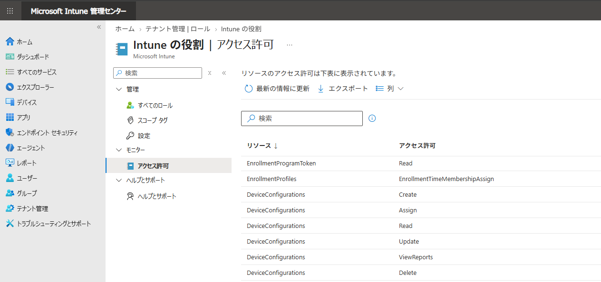
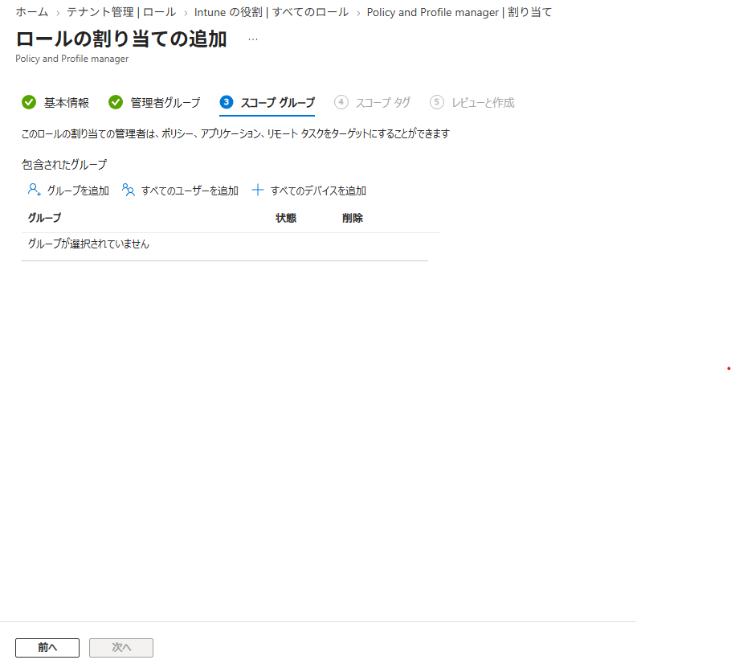
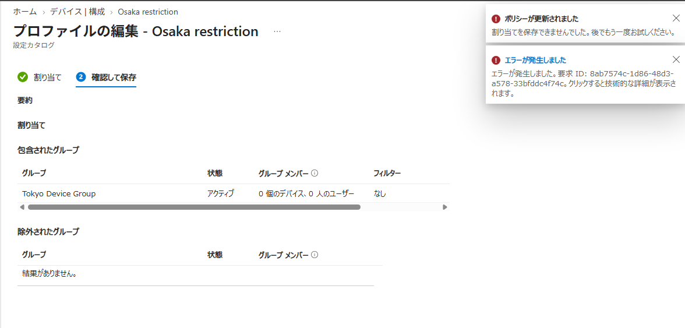

# 大規模な Intune 環境で管理者の権限を適切に分ける。ロール・スコープ タグ・スコープ グループ・複数管理者承認の使いどころ

みなさま、こんにちは。Intune サポート チームです。

Intune は近年、大規模なお客様にもご利用いただく機会が増えてきました。複数の関連会社や複数の拠点の管理者が、1 つの Intune テナントを共同で管理するような環境も、めずらしくありません。

このような環境でよくいただくのが、「管理者が、別の拠点のデバイスまで操作出来てしまうのが心配」「関連会社の管理者には、自社のポリシーだけを見せたい」「他の管理者が勝手に設定変更を行えないようにしたい」といったご相談です。

大規模な環境でどのように権限を振り分けるのが正解か、というのは組織の体制や運用方針によっても変わってくるため、一概に答えがあるわけではありません。ただ、Intune にはこうした「権限の分け方」を支える機能がいくつか用意されており、それぞれの役割を押さえておくと、ご自身の環境に合った設計を考えやすくなります。

そこで今回は、大規模な環境で管理者の権限を適切に管理するための次の 4 つの機能を、順番にご紹介します。

1. Intune の組み込みのロールとカスタム ロール
2. スコープ タグ
3. スコープ グループ
4. 複数の管理者による承認 (Multi Admin Approval)

なお、大規模な環境で Intune を運用する際の考え方については、下記の公開情報にもまとまっていますので、あわせてご覧ください。

- Microsoft Intune の大規模な環境のためのガイドライン
  https://learn.microsoft.com/ja-jp/intune/fundamentals/scale-guidelines

## 1. Intune の組み込みのロールとカスタム ロール

まず最初に考えたいのが、「管理者に何をさせるか (= どの操作を許可するか)」を決めるロールです。

Intune の管理者というと、Microsoft Entra ID の「Intune 管理者」や「グローバル管理者」といったロールを割り当てているケースも多いかと思います。ただ、これらの Entra ID のロールは Intune 全体に対するフル アクセスを持つ非常に強い権限で、スコープ タグによる制限も受けません。日常的な運用を行う管理者 1 人 1 人に割り当てるには、少し強すぎる場合があります。

「ヘルプデスクの担当者にはデバイスの確認と同期だけ」「ポリシー担当者にはプロファイルの作成と割り当てまで」といったように、必要な操作だけを許可したい場合は、Intune 側に用意されている RBAC (ロールベースのアクセス制御) のロールを利用しましょう。

Intune には、次の公開情報で紹介しているような組み込みのロールがあらかじめ用意されています。

- Intune での組み込みロールのアクセス許可
  https://learn.microsoft.com/ja-jp/intune/fundamentals/role-based-access-control/ref-built-in-roles

組み込みのロールでは「ちょっと権限が多い」「この操作だけ追加したい」というときは、カスタム ロールを作成して、リソースごとに「読み取り / 作成 / 更新 / 削除 / 割り当て」といったアクセス許可を細かく選ぶことができます。

- Intune でカスタム ロールを作成する
  https://learn.microsoft.com/ja-jp/intune/fundamentals/role-based-access-control/create-custom-role

### 今のアカウントにどんな権限が割り当たっているかを確認する

ロールを設計していると、「このアカウントには、結局どの権限が割り当たっているんだっけ？」と確認したくなる場面がよくあります。

現在サインインしているアカウントに割り当てられているアクセス許可は、Intune 管理センターの下記の画面から一覧で確認できます。

- [テナント管理] - [ロール] - [アクセス許可]

また、下記の画面から他の管理者に割り振られているアクセス許可も確認することが出来ます。

- [テナント管理] - [ロール] - [管理者のアクセス許可]

これらの画面では、リソース (DeviceConfigurations など) ごとに、どのアクセス許可 (Read / Create / Assign など) が付与されているかが表示されます。権限の変更後、実際に反映されるまでには時間が掛かることもあります。権限を変更して検証を行っているときにも、変更した権限が実際にユーザーに割り当たっているかをすぐに確認できるので、ぜひ活用してください。

### 管理者に Intune のライセンスは必要？

ライセンス未付与の管理者のアクセスが有効になっていれば、Intune の管理者は、Intune ライセンスが割り当てられていなくても、Intune 管理センターにサインインして管理を行うことができます。2021 年 7 月以降に作成されたテナントでは既定で有効になっており、2021 年 7 月より前に作成されたテナントは [テナント管理] - [ロール] - [設定] から手動で有効にする必要があります。ロールを割り当てたにも関わらず、思った通り動かないなと思ったら、まずはこの点を確認してみてください。

また、デメリットがあるような機能ではありませんが、一度有効にすると元に戻せないため、念のため、ご注意ください。

- Microsoft Intune のライセンス プランとオプション - ライセンスのない管理者アクセス
  https://learn.microsoft.com/ja-jp/intune/fundamentals/licensing#unlicensed-admin-access

## 2. スコープ タグ

ロールが「何をさせるか」を決めるのに対して、スコープ タグは「どのオブジェクトを見せるか」を決める仕組みです。

たとえば、東京と大阪の拠点にそれぞれ管理者がいて、「大阪の管理者には大阪向けのポリシーやデバイスだけを見せたい」という場合、次のように設定します。

1. 「大阪」というスコープ タグを作成する
2. 大阪向けの構成プロファイルやアプリ、デバイスに「大阪」のスコープ タグを付ける
3. 大阪の管理者グループに対するロールの割り当てで、スコープ タグに「大阪」を指定する

こうしておくと、大阪の管理者は「大阪」タグが付いたオブジェクトだけを表示・操作できるようになり、東京向けのポリシーは一覧にも表示されなくなります。

- 分散 IT にロールベースのアクセス制御 (RBAC) とスコープのタグを使用する
  https://learn.microsoft.com/ja-jp/intune/fundamentals/role-based-access-control/scope-tags

スコープ タグを利用するうえで、押さえておきたいポイントをいくつか挙げておきます。

- スコープ タグが付いていないオブジェクトには、自動的に「既定 (Default)」のスコープ タグが付与されます
- ロールの割り当てにスコープ タグを 1 つも指定していない管理者は、実質的にすべてのスコープ タグを持っているのと同じ扱いになり、ロールのアクセス許可の範囲ですべてのオブジェクトを表示できます
- 管理者が新しくオブジェクトを作成すると、その管理者に割り当てられているスコープ タグが自動的に付与されます
- Intune の RBAC とスコープ タグは、Entra ID のロール (Intune 管理者など) には適用されません

### 別々のロールから、それぞれ異なるスコープ タグを割り当てたときの動作

スコープ タグを使い始めると、「本社向けには読み取り専用、地域拠点向けにはフル アクセス」といったように、同じ管理者グループに対して、異なるスコープ タグを持つ複数のロールを割り当てたくなることがあります。

ただ、複数のロールの割り当てを組み合わせると、どうしても管理が複雑になりがちです。上記のような例の場合、読み取り専用の管理者アカウントを別に作ってしまうのも一つの手法です。また、ロールの割り当ては運用中も都度更新を行っていくことが想定されるため、可能な限り、ロールの割り当てはシンプルに保つのがおすすめですが、どうしても必要な場合は、次の動作を知っておいてください。

**既定の動作 (アクセス許可のマージ)**

既定では、同じアクセス許可カテゴリ (例: モバイル アプリ) を含む複数のロールの割り当てが 1 つの管理者グループにある場合、Intune はそれらのアクセス許可をマージして評価します。

たとえば、「アプリ管理者」グループに対して、

- スコープ タグ「東京」で、モバイル アプリの「読み取り」のみを許可するロール
- スコープ タグ「大阪」で、モバイル アプリの「作成 / 読み取り / 更新 / 削除」を許可するロール

の 2 つを割り当てた場合、アクセス許可がマージされる結果、「東京」のアプリに対してもフル アクセスが可能になってしまいます。「本社は読み取り専用にしたかったのに…」という、意図しない権限の広がりが起きてしまうのです。

**スコープ付きアクセス許可 (オプトインのパブリック プレビュー)**

この動作を変更するものとして、2026 年 3 月に「スコープ付きアクセス許可」がオプトインのパブリック プレビューとして導入されました。この設定を有効にすると、各ロールの割り当てのアクセス許可は、そのスコープ タグの範囲内でのみ適用されるようになります。先ほどの例でいえば、「東京」は読み取り専用、「大阪」はフル アクセス、といった動作になります。

設定は [テナント管理] - [ロール] - [設定] にあり、同じ画面から「アクセス許可評価レポート」を生成して、有効化した場合に各管理者グループの権限がどのように変わるかを事前に確認できます。

ただし、**この変更は一度有効にすると元に戻すことができません。** また、現時点ではプレビューではあるため、**機能が完全ではない可能性があります。** ご利用いただく場合には、必ずアクセス許可評価レポートで影響を確認し、プレビューの機能であることを考慮した上で有効化してください。

- ロールの割り当て全体でのアクセス許可の動作
  https://learn.microsoft.com/ja-jp/intune/fundamentals/role-based-access-control/scope-tags#permission-behavior-across-role-assignments

## 3. スコープ グループ

さて、ロールの割り当てを作成していると、「管理者グループ」の次に「スコープ グループ」という画面が出てきます。このスコープ グループという概念は、最初は非常にわかりづらい概念です。

ポイントは、ロールの割り当てには「2 種類のグループ」が登場するという点です。

| 画面 | 役割 | 例 |
| --- | --- | --- |
| 管理者グループ | **誰が** 管理するか (管理者が所属するグループ) | 「大阪 IT 管理者」グループ |
| スコープ グループ | **どのグループを** 管理できるか (管理対象のユーザー / デバイスが所属するグループ) | 「大阪のユーザー」「大阪のデバイス」グループ |

スコープ グループに指定したグループだけが、その管理者にとっての「管理対象」になります。具体的には、管理者がポリシーやアプリを割り当てられるグループが、スコープ グループに指定したグループに限られます。すでに別のグループに割り当て済みのポリシーやアプリを更新・削除する場合も、その割り当て先がスコープ グループに含まれている必要があります。また、リモート アクション (同期やワイプなど) を実行したりできるのは、デバイス自身、またはそのデバイスのユーザーがスコープ グループに含まれている場合に限られます。

スコープ タグとの違いを整理すると、次のようになります。

- スコープ タグ: 管理者が **どのオブジェクト (ポリシー、アプリ、デバイスなど) を表示・操作できるか** を決める
- スコープ グループ: 管理者が **どのグループに対してポリシーやアプリを割り当てたり操作したりできるか** を決める

ちょっとイメージしづらいと思いますので、実際にスコープ グループで制御を行った時の例を紹介していきます。

### スコープ グループでの制御の一例

例えば、大阪拠点の管理者がポリシーの割り当てを行うシナリオを想定してください。

この場合、スコープ タグで制御を行えば、「大阪」というスコープ タグがついたポリシーだけを、大阪拠点の管理者に見せることが出来ます。このため、スコープ タグを使えば、間違えて東京拠点向けのポリシーを大阪拠点の管理者が変更してしまうといった操作は防ぐことが可能です。

しかし、スコープ タグのみで制御している場合には、大阪拠点の管理者は、大阪拠点向けのポリシーは自由に変更出来てしまうため、誤って **大阪拠点向けポリシーを東京のデバイス グループへ割り当ててしまう** といった操作は出来てしまいます。

こういった操作を防ぐために存在するのが、スコープ グループでの制御になります。具体的には、スコープ グループで指定していないグループを割り当てようとした時は、下記のようなエラーが発生します。逆にロールの設定を正しくしたつもりにも関わらず、下記のエラーが出てしまう場合には、スコープ グループの設定を疑ってみてください。

### スコープ グループで制限する必要がない場合

「スコープ タグだけで十分で、スコープ グループによる制限は使わない」という運用の場合もあるかと思います。その場合は、スコープ グループとして **「すべてのユーザー」と「すべてのデバイス」の両方** を必ず指定しておいてください。

こうしておくと、すべてのグループに対する割り当てや操作が許可されるため、スコープ グループの設定の影響を受けずに運用できます。

## 4. 複数の管理者による承認 (Multi Admin Approval)

最後にご紹介するのは、少し観点の異なる機能です。ここまでの 3 つは「管理者の権限をどう分けるか」の話でしたが、複数管理者承認 (MAA) は「権限を持つ管理者が操作をするときに、もう 1 人の承認を必須にする」仕組みです。

- Intune で複数管理承認を使用する
  https://learn.microsoft.com/ja-jp/intune/fundamentals/role-based-access-control/multi-admin-approval

管理者アカウントが万が一侵害された場合、攻撃者がそのアカウントでスクリプトやアプリを全デバイスに配布してしまう…というのは、大規模な環境ほど影響が大きいリスクです。また、大きな環境ほど小さな一つの設定ミスが、大きな問題へつながってしまいます。MAA を使うと、「アクセス ポリシー」で保護対象のリソースと承認者グループを指定し、保護対象への変更は別の管理者が明示的に承認するまで適用されないようにできます。

保護できるリソースの種類には、次のようなものがあります。

- アプリ
- コンプライアンス ポリシー
- 構成ポリシー
- デバイス アクション (ワイプ、削除、廃止)
- ロール
- スクリプト
- テナント構成

利用にあたっての主なポイントは次のとおりです。

- テナントに少なくとも 2 つの管理者アカウントが必要です (自分の要求を自分で承認することはできません)
- 承認者グループは **セキュリティ グループ** である必要があり、かつメンバー グループとして Intune の RBAC ロールの割り当てに直接追加されている必要があります
- 承認者には、承認対象のリソースに対する読み取りアクセス許可が必要です
- 要求は 3 日以内に処理されないと期限切れになります。また、新しい要求が作成されても Intune から通知は送られないため、承認者への連絡は運用でカバーする必要があります
- 「ロール」の種類のアクセス ポリシーを有効にすると、MAA 自体に必要な RBAC の割り当てを変更する際にも承認が必要になります。設定の順番によってはデッドロックが起こりうるため、ロールのアクセス ポリシーは他の設定が整った最後に有効化することをおすすめします

## おわりに

今回は、大規模な Intune 環境で管理者の権限を適切に管理するための 4 つの機能をご紹介しました。

- **ロール**: 管理者に「何をさせるか」を決める。Entra ID のロールが強すぎる場合は Intune の組み込みロール / カスタム ロールを利用する
- **スコープ タグ**: 管理者に「どのオブジェクトを見せるか」を決める。複数ロールの組み合わせはアクセス許可がマージされる点に注意
- **スコープ グループ**: 管理者が「どのグループを」管理できるかを決める。使わない場合は「すべてのユーザー」と「すべてのデバイス」を指定する
- **複数管理者承認**: 重要な変更に 2 人目の管理者の承認を必須にして、アカウント侵害時や設定ミスの際の被害を抑える

権限設計はいったん作り込むと後から変えるのが大変なので、はじめはシンプルな構成から始めて、必要に応じてスコープ タグやスコープ グループを足していくのがおすすめです。設計に迷った際は、[テナント管理] - [ロール] - [アクセス許可] の画面で、実際に割り当たっている権限を確認しながら進めてみてください。

この記事が、みなさまの Intune 環境の権限設計のお役に立てばうれしいです。それでは、また次回の記事でお会いしましょう！
